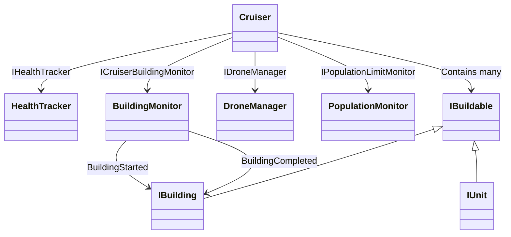
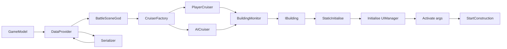
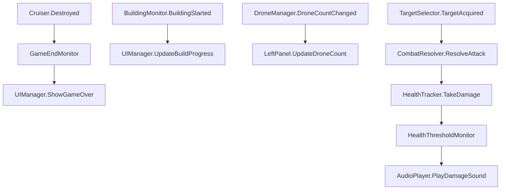

# Battlecruisers Architecture Guide

**Date:** October 10, 2025
**Project:** BattleCruisers - Comprehensive Software Architecture Overview
**Target Audience:** Software Engineers and Game Developers
**Purpose:** Provide detailed technical documentation enabling independent feature development and system understanding

---

## Executive Overview

BattleCruisers is a Unity-based real-time strategy (RTS) game where players construct and manage customizable battlecruisers equipped with various buildings and units. The gameplay revolves around tactical decision-making, resource management, drone-based building mechanics, and strategic combat against AI opponents.

This architecture guide provides a comprehensive technical breakdown of BattleCruisers' systems, enabling new developers to understand, extend, and modify the codebase without requiring access to the original source code. The guide focuses on:

- **System Architecture:** Detailed explanation of component relationships and data flow
- **Interface Usage:** How the codebase leverages interfaces for extensibility
- **Integration Points:** Where new features can be safely injected
- **Feature Implementation Patterns:** Proven approaches for common modifications
- **Debugging and Testing Strategies:** Methods for validating changes

---

## Core Architecture Philosophy

BattleCruisers employs a **highly modular, interface-driven architecture** where:

1. **Interfaces Define Contracts:** Nearly every major system is defined through interfaces (e.g., `IBattleSceneHelper`, `ICruiser`, `IBuildable`)
2. **Dependency Injection:** Components receive dependencies through constructors or initialization methods
3. **Event-Driven Communication:** Systems communicate through events rather than direct coupling
4. **Factory Pattern Usage:** Object creation is centralized through factory classes
5. **Composition Over Inheritance:** Complex behaviors are composed from simpler components

This design enables:
- **Easy Testing:** Mock implementations of interfaces for unit testing
- **Feature Isolation:** New features can be added without modifying existing code
- **Runtime Configuration:** Different implementations can be swapped based on game mode or settings
- **Maintainability:** Clear separation of concerns reduces coupling

---

## Table of Contents

1. [System Architecture Overview](#system-architecture-overview)
2. [Data Models and Persistence](#data-models-and-persistence)
3. [Battle Scene Management](#battle-scene-management)
4. [Cruiser and Buildable Systems](#cruiser-and-buildable-systems)
5. [AI and Strategy Systems](#ai-and-strategy-systems)
6. [User Interface Architecture](#user-interface-architecture)
7. [Save/Load and Progression](#saveload-and-progression)
8. [Feature Integration Patterns](#feature-integration-patterns)
9. [Common Extension Points](#common-extension-points)
10. [Debugging and Testing](#debugging-and-testing)

---

## System Architecture Overview

### Core Design Principles

**1. Interface-First Design**
```csharp
// Example: IBattleSceneHelper defines the contract for mode-specific behavior
public interface IBattleSceneHelper
{
    IManagedDisposable CreateAI(Cruiser aiCruiser, Cruiser playerCruiser, int level);
    Loadout GetPlayerLoadout();
    bool ShowInGameHints { get; }
    IPrefabKey GetAiCruiserKey();
    // ... additional methods
}
```

**2. Factory Pattern for Object Creation**
```csharp
// Centralized object creation prevents tight coupling
public class CruiserFactory
{
    private readonly IBattleSceneHelper _helper;
    private readonly UIManager _uiManager;

    public CruiserFactory(IBattleSceneHelper helper, UIManager uiManager)
    {
        _helper = helper;
        _uiManager = uiManager;
    }

    public Cruiser CreatePlayerCruiser() { /* implementation */ }
    public Cruiser CreateAICruiser(IPrefabKey key) { /* implementation */ }
}
```

**3. Event-Driven Communication**
```csharp
// Systems communicate through events, not direct method calls
public class Cruiser
{
    public event EventHandler<DestroyedEventArgs> Destroyed;
    public event EventHandler BuildingCompleted;

    private void OnHealthGone()
    {
        Destroyed?.Invoke(this, new DestroyedEventArgs(this));
    }
}
```

## Common Pitfalls and Anti-Patterns

This section documents common mistakes discovered during development, particularly from the Endless Mode implementation. Understanding these pitfalls helps prevent architectural violations and ensures new features integrate smoothly.

### Pitfall 1: Violating Buildable Lifecycle

**Problem:** Incorrect order of operations during unit/building creation causes runtime failures.

**Anti-Pattern (Common Mistake):**
```csharp
var wrapper = UnityEngine.Object.Instantiate(prefab);
wrapper.gameObject.SetActive(true);    // ❌ Activates too early
wrapper.StaticInitialise();
unit.Activate(args);                   // ❌ Fails assertion in Buildable.cs
```

**Why It Fails:** `Activate()` expects the GameObject to be inactive (`Assert.IsFalse(_parent.activeSelf)` in Buildable.cs line 307).

**Correct Pattern:**
```csharp
var wrapper = UnityEngine.Object.Instantiate(prefab);
wrapper.gameObject.SetActive(false);   // ✅ Keep inactive until Activate()
wrapper.StaticInitialise();
unit.Initialise(uiManager);            // ✅ Don't forget this critical step!
unit.Activate(args);                   // ✅ Now it activates safely
```

**Lesson:** The buildable lifecycle is strict and enforced by assertions. Always follow the exact sequence.

### Pitfall 2: Forgetting Initialise(UIManager)

**Problem:** Units fail to initialize properly, causing null reference exceptions later.

**Anti-Pattern:**
```csharp
unit.StaticInitialise();
unit.Activate(activationArgs);  // ❌ Missing Initialise(UIManager) call
```

**Why It Fails:** `Initialise(UIManager)` sets up critical internal state. Without it, many properties are null, causing crashes when the unit tries to use them.

**Correct Pattern:**
```csharp
unit.StaticInitialise();          // Unity component setup
unit.Initialise(uiManager);       // ✅ Game logic initialization
unit.Activate(activationArgs);    // Activation and positioning
```

**Lesson:** Never skip the `Initialise(UIManager)` call - it's required for proper unit functionality.

### Pitfall 3: Assuming Buildings Follow Moving Cruisers

**Problem:** Buildings appear to float in mid-air when cruisers move (discovered in Endless Mode).

**Critical Misconception:**
```csharp
// Buildings are NOT children of cruiser in Unity hierarchy
cruiser.Position = Vector3.Lerp(startPos, homePos, t);  // ✅ Cruiser moves
// Buildings stay at original position - they don't follow!
```

**Why It Happens:** Buildings are independent GameObjects with their own transforms. Their positions are set once at creation time relative to the cruiser's position at that moment.

**Root Cause Evidence:**
```csharp
// Buildings are instantiated independently:
IBuilding building = Instantiate(buildingPrefab);
building.transform.position = cruiser.Position + slotOffset;  // Set once
// NOT: building.transform.SetParent(cruiser.transform);
```

**Solutions (Choose Based on Needs):**
1. **Keep cruisers stationary** - Simplest and most compatible
2. **Pre-build everything before movement** - Build first, then move
3. **Implement continuous position updates** - Update building positions every frame (performance cost)
4. **Make buildings children** - Parent them to cruiser transform (may break collision systems)

**Lesson:** Any feature involving moving cruisers must account for this fundamental limitation from the start.

### Pitfall 4: Trying to Access Protected Members

**Problem:** Attempting to force-complete units or access internal state.

**Anti-Pattern:**
```csharp
concreteUnit.BuildableState = BuildableState.Completed;  // ❌ Protected setter
concreteUnit.OnBuildableCompleted();                     // ❌ Protected method
unit.BuildProgress.Set(1.0f);                            // ❌ No such method
```

**Why It Fails:** These members are protected for good reason - they handle complex internal state management that external code shouldn't manipulate.

**Correct Approach:**
```csharp
unit.StartConstruction();  // ✅ Let normal construction flow handle completion
// Or accept that units need build time in your game mode
```

**Lesson:** Work with public interfaces. Don't fight the access modifiers - the architecture is designed this way for maintainability.

### Pitfall 5: Destroying Unity Prefab Assets

**Problem:** Attempting to destroy death explosion GameObjects causes Unity warnings.

**Anti-Pattern:**
```csharp
Destroy(deathExplosion.gameObject);  // ❌ "Destroying assets is not permitted"
```

**Why It Fails:** Unity distinguishes between scene instances (can be destroyed) and prefab assets (cannot be destroyed at runtime).

**Correct Pattern:**
```csharp
deathExplosion.gameObject.SetActive(false);  // ✅ Just hide it
```

**Lesson:** When unsure about object lifecycle, use `SetActive(false)` instead of `Destroy()`.

### Pitfall 6: Wrong Event Property Names

**Problem:** Incorrect property access on event arguments.

**Anti-Pattern:**
```csharp
private void OnBuildingStarted(object sender, BuildingStartedEventArgs e)
{
    IBuilding building = e.Building;  // ❌ Property doesn't exist
}
```

**Correct Pattern:**
```csharp
private void OnBuildingStarted(object sender, BuildingStartedEventArgs e)
{
    IBuilding building = e.StartedBuilding;  // ✅ Actual property name
}
```

**Event Args Property Pattern:**
```csharp
BuildingStartedEventArgs    → StartedBuilding
BuildingCompletedEventArgs  → CompletedBuilding
BuildingDestroyedEventArgs  → DestroyedBuilding
```

**Lesson:** Always check the actual property names on event arguments - they're not always what you'd expect.

### Pitfall 7: Namespace Ambiguities

**Problem:** Conflicting names between Unity and .NET namespaces.

**Anti-Pattern:**
```csharp
Random.Range(0, count);      // ❌ Ambiguous: UnityEngine.Random vs System.Random
Object.Instantiate(prefab);  // ❌ Ambiguous: UnityEngine.Object vs object
```

**Correct Pattern:**
```csharp
UnityEngine.Random.Range(0, count);     // ✅ Explicit qualification
UnityEngine.Object.Instantiate(prefab); // ✅ Explicit qualification
```

**Lesson:** When using common names, explicitly qualify them with the UnityEngine namespace.

### Pitfall 8: Incorrect BuildableActivationArgs Location

**Problem:** Wrong namespace for activation arguments.

**Anti-Pattern:**
```csharp
using BattleCruisers.Buildables;  // ❌ BuildableActivationArgs not here
```

**Correct Pattern:**
```csharp
using BattleCruisers.Buildables.Pools;  // ✅ BuildableActivationArgs lives here
```

**Lesson:** Check the actual namespace for types - they're not always where intuition suggests.

### System Diagrams

#### Battle Initialization Flow
```mermaid
flowchart TD
    A[BattleSceneGod.Start()] --> B[CreateHelper()]
    B --> C{GameMode?}
    C -->|Endless| D[EndlessHelper]
    C -->|Campaign| E[NormalHelper]
    C -->|Tutorial| F[TutorialHelper]
    D --> G[Create CruiserFactory]
    E --> G
    F --> G
    G --> H[CreatePlayerCruiser()]
    G --> I[CreateAICruiser()]
    I --> J[CreateAI()]
    J --> K{Mode-Specific?}
    K -->|Endless| L[EndlessAIStrategy]
    K -->|Other| M[StandardAIStrategy]
    H --> N[Initialize UI Components]
    N --> O[Subscribe to Events]
    O --> P[Start Game Loop]
```

#### Cruiser Subsystem Composition


#### Data Flow Architecture


#### Event-Driven Communication


### Key Architectural Files

#### 1. **ApplicationModel.cs**
- **Location:** `Assets/Scripts/Data/ApplicationModel.cs`
- **Purpose:** Global game state container and mode management
- **Key Properties:**
  ```csharp
  public enum GameMode
  {
      Campaign = 1,
      Tutorial = 2,
      Skirmish = 3,
      PvP_1VS1 = 4,
      CoinBattle = 5,
      SideQuest = 6,
      Endless = 7  // Extensible for new modes
  }

  public static GameMode Mode { get; set; }
  public static int SelectedLevel { get; set; }
  public static Loadout PlayerLoadout { get; set; }
  ```

#### 2. **GameModel.cs**
- **Location:** `Assets/Scripts/Data/Models/GameModel.cs`
- **Purpose:** Complete player progression and inventory state
- **Key Features:**
  - **Currency Management:** Credits, coins, battle scores
  - **Unlock System:** Tracks unlocked hulls, buildings, units
  - **Progression Tracking:** Completed levels, side quests, achievements
  - **Inventory Management:** Purchased cosmetics, variants, captains
  - **Loadout Persistence:** Current ship configuration and selected items

#### 3. **Serializer.cs**
- **Location:** `Assets/Scripts/Data/Serializer.cs`
- **Purpose:** Game state persistence and cloud synchronization
- **Key Methods:**
  ```csharp
  public void SaveGame(GameModel game)  // Binary serialization to local file
  public GameModel LoadGame()           // Binary deserialization with compatibility handling
  public async Task CloudSave(GameModel game)  // JSON serialization to Unity Cloud Save
  public async Task<GameModel> CloudLoad(GameModel game)  // Cloud data loading and merging
  ```

---

## Data Models and Persistence

### GameModel Structure

The `GameModel` class serves as the central data repository for all player-related state:

```csharp
[Serializable]
public class GameModel
{
    // Currency and scoring
    private long _credits;
    private long _coins;
    private float _battleWinScore;
    private long _lifetimeDestructionScore;
    private long _bestDestructionScore;

    // Progression tracking
    private List<CompletedLevel> _completedLevels;
    private List<CompletedLevel> _completedSideQuests;
    private List<HullKey> _unlockedHulls;
    private List<BuildingKey> _unlockedBuildings;
    private List<UnitKey> _unlockedUnits;

    // Inventory and purchases
    private List<int> _purchasedExos;        // Captain cosmetics
    private List<int> _purchasedHeckles;     // Victory animations
    private List<int> _purchasedBodykits;    // Ship visual variants
    private List<int> _purchasedVariants;    // Additional cosmetics

    // Player configuration
    private Loadout _playerLoadout;
    private SettingsModel _settings;
    private string _playerName;

    // Game state
    private BattleResult _lastBattleResult;
    private int _selectedLevel;
    private bool _hasAttemptedTutorial;
}
```

### Loadout System

The `Loadout` class manages the player's current ship configuration:

```csharp
public class Loadout
{
    public Dictionary<BuildingCategory, List<BuildingKey>> SelectedBuildings { get; }
    public Dictionary<UnitCategory, List<UnitKey>> SelectedUnits { get; }
    public CaptainExoKey CurrentCaptain { get; set; }
    public List<int> SelectedVariants { get; set; }
    public List<int> CurrentHeckles { get; set; }

    // Methods for managing selections
    public void AddBuilding(BuildingCategory category, BuildingKey building) { }
    public void RemoveBuilding(BuildingCategory category, BuildingKey building) { }
    public bool SmartEquals(Loadout other) { }  // Deep equality comparison
}
```

### Serialization Architecture

**Binary Serialization (Local Save):**
```csharp
// Serializer.cs - Local file persistence
public void SaveGame(GameModel game)
{
    using (FileStream file = File.Create(gameModelFilePath))
    {
        _binaryFormatter.Serialize(file, game);
    }
}

public GameModel LoadGame()
{
    using (FileStream file = File.Open(gameModelFilePath, FileMode.Open))
    {
        object output = _binaryFormatter.Deserialize(file);
        return MakeCompatible(output);  // Handle version compatibility
    }
}
```

**JSON Serialization (Cloud Save):**
```csharp
// Cloud synchronization using Unity Services
public async Task CloudSave(GameModel game)
{
    SaveGameModel saveData = new SaveGameModel(game);
    var serializedData = SerializeGameModel(saveData);
    var data = new Dictionary<string, object> { { "GameModel", serializedData } };
    await CloudSaveService.Instance.Data.ForceSaveAsync(data);
}
```

**Compatibility Handling:**
The serializer includes sophisticated version compatibility handling:

```csharp
private GameModel MakeCompatible(object gameData)
{
    // Extract data using reflection to handle missing properties
    var tut = gameData.GetType().GetProperty("HasAttemptedTutorial").GetValue(gameData);
    var lds = gameData.GetType().GetProperty("LifetimeDestructionScore").GetValue(gameData);

    // Reconstruct GameModel with compatible defaults
    GameModel compatibleGameModel = new GameModel(
        _hasSyncdShop: false,
        _hasAttemptedTutorial: (bool)tut,
        _lifetimeDestructionScore: (long)lds,
        _bestDestructionScore: (long)bds,
        _loadout: (Loadout)plo,
        _lastBattleResult: (BattleResult)lbr,
        _unlockedHulls: _unlockedHulls,
        _unlockedBuildings: _unlockedBuildings,
        _unlockedUnits: _unlockedUnits
    );

    // Apply legacy data migration
    // ... complex migration logic for purchased items, completed levels, etc.
}
```

---

## Battle Scene Management

### BattleSceneGod Architecture

**Location:** `Assets/Scripts/Scenes/BattleScene/BattleSceneGod.cs`

The `BattleSceneGod` class is the central orchestrator for battle scenes, implementing a **highly structured initialization sequence**:

```csharp
public class BattleSceneGod : MonoBehaviour
{
    // Dependency injection through initialization
    private async void Start()
    {
        // 1. Component initialization
        components = GetComponent<BattleSceneGodComponents>();
        components.Initialise();

        // 2. Mode-specific helper creation
        IBattleSceneHelper helper = CreateHelper(components.Deferrer, navigationPermitters);

        // 3. Factory setup
        CruiserFactory cruiserFactory = new CruiserFactory(helper, uiManager);

        // 4. Cruiser creation and setup
        playerCruiser = cruiserFactory.CreatePlayerCruiser();
        aiCruiser = cruiserFactory.CreateAICruiser(helper.GetAiCruiserKey());

        // 5. AI initialization
        IManagedDisposable ai = helper.CreateAI(aiCruiser, playerCruiser, ApplicationModel.SelectedLevel);

        // 6. UI initialization
        LeftPanelComponents leftPanel = leftPanelInitialiser.Initialise(/* ... */);

        // 7. Event system setup
        _gameEndMonitor = new GameEndMonitor(/* ... */);

        // 8. Audio system initialization
        // 9. Visual effects setup
        // 10. Tutorial system (if applicable)
    }

    // Factory method for mode-specific helpers
    private IBattleSceneHelper CreateHelper(IDeferrer deferrer, NavigationPermitters navigationPermitters)
    {
        switch (ApplicationModel.Mode)
        {
            case GameMode.Tutorial:
                return new TutorialHelper(navigationPermitters);
            case GameMode.Campaign:
                return new NormalHelper(deferrer);
            case GameMode.Endless:
                return new EndlessHelper(deferrer);
            // ... additional cases
        }
    }
}
```

### Component-Based Architecture

BattleSceneGod uses composition to manage complex systems:

```csharp
// Separate components for different concerns
private BattleSceneGodComponents components;      // Core scene components
private CameraComponents cameraComponents;        // Camera and view management
private LeftPanelComponents leftPanelComponents;  // Build menu and drone management
private RightPanelComponents rightPanelComponents; // Game controls and menus

// Event-driven systems
private GameEndMonitor _gameEndMonitor;           // Battle completion detection
private CruiserDeathManager _cruiserDeathManager; // Death effects and cleanup
private LifetimeManager _lifetimeManager;         // Scene lifetime management
```

### Helper Pattern for Mode-Specific Behavior

Each game mode implements `IBattleSceneHelper`:

```csharp
public interface IBattleSceneHelper
{
    // AI creation
    IManagedDisposable CreateAI(Cruiser aiCruiser, Cruiser playerCruiser, int level);

    // Configuration methods
    Loadout GetPlayerLoadout();
    IPrefabKey GetAiCruiserKey();
    bool ShowInGameHints { get; }
    Level GetLevel();
    SideQuestData GetSideQuest();

    // UI and audio configuration
    UIManager CreateUIManager();
    ButtonVisibilityFilters CreateButtonVisibilityFilters(IDroneManager droneManager);

    // Async operations
    Task<string> GetEnemyNameAsync(int levelNum);
    Task<PrefabContainer<BackgroundImageStats>> GetBackgroundStatsAsync(int levelNum);
}
```

**Example Implementation:**
```csharp
public class EndlessHelper : BattleSceneHelper
{
    private readonly IDeferrer _deferrer;

    public EndlessHelper(IDeferrer deferrer)
    {
        _deferrer = deferrer;
    }

    public override IManagedDisposable CreateAI(Cruiser aiCruiser, Cruiser playerCruiser, int level)
    {
        // Custom AI strategy for endless mode
        return new EndlessAIStrategy(aiCruiser, playerCruiser, level);
    }

    public override bool ShowInGameHints => false;  // Disable tutorials in endless mode

    // ... additional overrides
}
```

---

## Cruiser and Buildable Systems

### Cruiser Architecture

Cruisers are complex entities composed of multiple subsystems:

```csharp
public class Cruiser : MonoBehaviour, ICruiser
{
    // Core properties
    public string Name { get; }
    public Sprite Sprite { get; }
    public float YAdjustmentInM { get; }
    public bool IsDestroyed { get; }

    // Position and movement
    public Vector3 Position { get; set; }
    public Quaternion Rotation { get; set; }

    // Combat and health
    public IHealthTracker HealthTracker { get; }
    public ICruiserDamageMonitor DamageMonitor { get; }

    // Building and construction
    public ICruiserBuildingMonitor BuildingMonitor { get; }
    public IDroneManager DroneManager { get; }
    public IPopulationLimitMonitor PopulationLimitMonitor { get; }

    // Events
    public event EventHandler<DestroyedEventArgs> Destroyed;
    public event EventHandler BuildingCompleted;
}
```

### Buildable System

Buildables follow a **strict lifecycle pattern**:

```csharp
public interface IBuildable
{
    // Lifecycle methods
    void StaticInitialise();                    // Unity component setup
    void Initialise(UIManager uiManager);       // Game logic initialization
    void Activate(BuildableActivationArgs args); // Activation and positioning
    void StartConstruction();                   // Begin building process

    // Properties
    Vector3 Position { get; set; }
    Quaternion Rotation { get; set; }
    BuildableState BuildableState { get; }
    float BuildProgress { get; }

    // Events
    event EventHandler<BuildableCompletedEventArgs> CompletedBuildable;
    event EventHandler<BuildableDestroyedEventArgs> DestroyedBuildable;
}
```

**Buildable Categories:**
```csharp
public enum BuildingCategory
{
    Factory,    // Production buildings (Air/Naval/Drone factories)
    Defence,    // Defensive turrets and shields
    Offence,    // Offensive weapons and turrets
    Tactical,   // Support buildings (shields, boosters)
    Ultra       // Special high-power buildings (nukes, kamikaze)
}

public enum UnitCategory
{
    Aircraft,   // Planes and helicopters
    Naval       // Ships and submarines
}
```

**Buildable Lifecycle Example:**
```csharp
// 1. Prefab instantiation (inactive)
var wrapper = UnityEngine.Object.Instantiate(prefab);
wrapper.gameObject.SetActive(false);  // CRITICAL: Must be inactive

// 2. Static initialization
wrapper.StaticInitialise();           // Sets up Unity components
IUnit unit = wrapper.Buildable;

// 3. Game logic initialization
unit.Initialise(uiManager);           // Sets up internal state

// 4. Positioning (before activation)
unit.Position = spawnPosition;
unit.Rotation = spawnRotation;

// 5. Activation (makes GameObject active)
unit.Activate(new BuildableActivationArgs(parentCruiser, enemyCruiser, factories));

// 6. Construction start
unit.StartConstruction();             // Begins build timer
```

### Factory Pattern for Object Creation

**CruiserFactory:**
```csharp
public class CruiserFactory
{
    private readonly IBattleSceneHelper _helper;
    private readonly UIManager _uiManager;

    public Cruiser CreatePlayerCruiser()
    {
        // Load player cruiser based on GameModel.PlayerLoadout
        HullKey hullKey = _helper.GetPlayerLoadout().CurrentHull;
        Cruiser cruiser = InstantiateCruiser(hullKey);

        // Initialize subsystems
        InitializeCruiserSystems(cruiser, isPlayer: true);
        return cruiser;
    }

    public Cruiser CreateAICruiser(IPrefabKey hullKey)
    {
        Cruiser cruiser = InstantiateCruiser(hullKey);
        InitializeCruiserSystems(cruiser, isPlayer: false);

        // AI-specific setup
        cruiser.AdjustStatsByDifficulty(_helper.GetDifficulty());
        return cruiser;
    }
}
```

**PrefabFactory:**
```csharp
public static class PrefabFactory
{
    // Centralized prefab loading and pooling
    public static IBuildableWrapper<IBuilding> GetBuildingWrapperPrefab(BuildingKey key) { }
    public static IBuildableWrapper<IUnit> GetUnitWrapperPrefab(UnitKey key) { }
    public static CaptainExo GetCaptainExo(CaptainExoKey key) { }

    // Pool management for performance
    public static void CreatePools() { }
}
```

---

## AI and Strategy Systems

### AI Architecture

AI systems are designed for **modularity and extensibility**:

```csharp
public interface IAIStrategy : IManagedDisposable
{
    void UpdateStrategy();                    // Called each frame
    void OnPlayerAction(PlayerAction action); // Respond to player input
    void OnBuildingCompleted(IBuilding building); // Respond to construction
}

public class EndlessAIStrategy : IAIStrategy
{
    private readonly Cruiser _aiCruiser;
    private readonly Cruiser _playerCruiser;

    public EndlessAIStrategy(Cruiser aiCruiser, Cruiser playerCruiser, int waveNumber)
    {
        _aiCruiser = aiCruiser;
        _playerCruiser = playerCruiser;

        // Initialize AI state based on wave number and player strength
        InitializeStrategyForWave(waveNumber);
    }

    public void UpdateStrategy()
    {
        // Analyze battlefield state
        AnalyzeThreats();
        PrioritizeTargets();

        // Make tactical decisions
        DecideBuildingConstruction();
        DecideUnitProduction();
        DecideAggressionLevel();
    }
}
```

### Targeting and Combat Systems

**Target Selection:**
```csharp
public interface ITargetSelector
{
    ITarget SelectOptimalTarget(IEnumerable<ITarget> availableTargets);
    void UpdateTargetPriorities();
}

public class AdaptiveTargetSelector : ITargetSelector
{
    private readonly Dictionary<TargetType, float> _priorityWeights;

    public ITarget SelectOptimalTarget(IEnumerable<ITarget> availableTargets)
    {
        return availableTargets
            .OrderByDescending(target => CalculateTargetScore(target))
            .FirstOrDefault();
    }

    private float CalculateTargetScore(ITarget target)
    {
        float baseScore = _priorityWeights[target.TargetType];
        float distanceFactor = CalculateDistanceFactor(target);
        float threatFactor = CalculateThreatFactor(target);

        return baseScore * distanceFactor * threatFactor;
    }
}
```

**Combat Resolution:**
```csharp
public interface ICombatResolver
{
    void ResolveAttack(ICombatant attacker, ITarget target, float damage);
    void ApplyDamageEffects(IDamageable target, DamageInfo damage);
}

public class StandardCombatResolver : ICombatResolver
{
    public void ResolveAttack(ICombatant attacker, ITarget target, float damage)
    {
        // Calculate hit probability, armor penetration, etc.
        float actualDamage = CalculateEffectiveDamage(attacker, target, damage);

        // Apply damage and effects
        target.TakeDamage(actualDamage, attacker, ignoreImmuneStatus: false);
    }
}
```

---

## User Interface Architecture

### UIManager and Component System

The UI system is **highly composable and event-driven**:

```csharp
public class UIManager
{
    // Component references
    private readonly LeftPanelComponents _leftPanel;
    private readonly RightPanelComponents _rightPanel;
    private readonly TopPanelComponents _topPanel;

    // Event subscriptions
    private readonly Dictionary<string, Action<object>> _eventHandlers;

    public void InitializeUI()
    {
        // Setup event subscriptions
        SubscribeToCruiserEvents();
        SubscribeToBuildableEvents();
        SubscribeToGameStateEvents();
    }

    public void UpdateUIForGameMode(GameMode mode)
    {
        // Mode-specific UI configuration
        switch (mode)
        {
            case GameMode.Endless:
                ConfigureEndlessModeUI();
                break;
            case GameMode.Tutorial:
                ConfigureTutorialUI();
                break;
        }
    }
}
```

### Panel Component Architecture

**LeftPanelComponents (Build Menu):**
```csharp
public class LeftPanelComponents
{
    public BuildMenu BuildMenu { get; }
    public DroneManagerMonitor DroneMonitor { get; }
    public BuildableButtons BuildableButtons { get; }

    public LeftPanelComponents Initialize(
        IDroneManager droneManager,
        DroneManagerMonitor droneMonitor,
        UIManager uiManager,
        Loadout playerLoadout,
        /* ... additional dependencies */)
    {
        // Initialize build menu with available buildings
        BuildMenu.Initialize(playerLoadout.SelectedBuildings);

        // Setup drone monitoring
        DroneMonitor.Initialize(droneManager);

        // Configure buildable buttons
        BuildableButtons.Initialize(uiManager, playerLoadout);

        return this;
    }
}
```

**RightPanelComponents (Game Controls):**
```csharp
public class RightPanelComponents
{
    public MainMenuManager MainMenuManager { get; }
    public SpeedComponents SpeedControls { get; }
    public InformatorPanel InfoPanel { get; }

    public RightPanelComponents Initialize(
        UIManager uiManager,
        Cruiser playerCruiser,
        IUserChosenTargetHelper targetHelper,
        /* ... */)
    {
        // Setup main menu (pause, settings, etc.)
        MainMenuManager.Initialize(uiManager);

        // Configure speed controls
        SpeedControls.Initialize(playerCruiser);

        // Setup information panel
        InfoPanel.Initialize(targetHelper);

        return this;
    }
}
```

### Event-Driven UI Updates

UI updates are driven by **domain events** rather than polling:

```csharp
// In BattleSceneGod.Start()
helper.InitialiseUIManager(
    playerCruiser,
    aiCruiser,
    leftPanelComponents.BuildMenu,
    itemDetailsManager,
    FactoryProvider.Sound.IPrioritisedSoundPlayer,
    FactoryProvider.Sound.UISoundPlayer);

// Event subscription pattern
private void SubscribeToCruiserEvents()
{
    playerCruiser.Destroyed += OnPlayerCruiserDestroyed;
    playerCruiser.BuildingMonitor.BuildingStarted += OnBuildingStarted;
    playerCruiser.DroneManager.DroneCountChanged += OnDroneCountChanged;
}

// Event handlers update UI state
private void OnPlayerCruiserDestroyed(object sender, DestroyedEventArgs e)
{
    _uiManager.ShowGameOverScreen(playerWon: false);
}
```

---

## Save/Load and Progression

### DataProvider Singleton

The `DataProvider` class serves as the **central data access point**:

```csharp
public static class DataProvider
{
    private static GameModel _gameModel;
    private static Serializer _serializer;

    public static GameModel GameModel
    {
        get => _gameModel ?? LoadOrCreateGameModel();
        set => _gameModel = value;
    }

    private static GameModel LoadOrCreateGameModel()
    {
        if (_serializer.DoesSavedGameExist())
        {
            return _serializer.LoadGame();
        }
        else
        {
            return StaticData.InitialGameModel;
        }
    }

    public static void SaveGame() => _serializer.SaveGame(GameModel);

    public static async Task SyncWithCloud()
    {
        await _serializer.CloudSave(GameModel);
        await _serializer.SyncCurrencyFromCloud();
        await _serializer.SyncInventoryFromCloud();
    }
}
```

### Progression System

**Level Completion Tracking:**
```csharp
public class CompletedLevel
{
    public int LevelNum { get; }
    public Difficulty HardestDifficulty { get; set; }
    public DateTime CompletedAt { get; }

    public CompletedLevel(int levelNum, Difficulty difficulty)
    {
        LevelNum = levelNum;
        HardestDifficulty = difficulty;
        CompletedAt = DateTime.UtcNow;
    }
}

// In GameModel.cs
public void AddCompletedLevel(CompletedLevel completedLevel)
{
    Assert.IsTrue(completedLevel.LevelNum <= _completedLevels.Count + 1,
                  "Have not completed preceding level");

    if (completedLevel.LevelNum > _completedLevels.Count)
    {
        // First time completion - add new entry
        _completedLevels.Add(completedLevel);

        // Unlock rewards (new buildings, units, etc.)
        UnlockLevelRewards(completedLevel.LevelNum);
    }
    else
    {
        // Replay - update difficulty if better
        CompletedLevel existing = _completedLevels[completedLevel.LevelNum - 1];
        if (completedLevel.HardestDifficulty > existing.HardestDifficulty)
        {
            existing.HardestDifficulty = completedLevel.HardestDifficulty;
        }
    }
}
```

**Unlock System:**
```csharp
public void AddUnlockedBuilding(BuildingKey building)
{
    if (!_unlockedBuildings.Contains(building))
    {
        _unlockedBuildings.Add(building);
        NewBuildings.AddItem(building);  // Trigger "new item" notification
    }
}

public void AddUnlockedUnit(UnitKey unit)
{
    if (!_unlockedUnits.Contains(unit))
    {
        _unlockedUnits.Add(unit);
        NewUnits.AddItem(unit);
    }
}
```

---

## Feature Integration Patterns

### Pattern 1: Pre-Built Buildables Feature

**Implementation Strategy:**

1. **Extend Loadout System:**
```csharp
public class Loadout
{
    // Add pre-built configuration
    public Dictionary<BuildingCategory, List<PreBuiltBuilding>> PreBuiltBuildings { get; set; }

    public class PreBuiltBuilding
    {
        public BuildingKey BuildingKey { get; }
        public int SlotIndex { get; }
        public float BuildProgress { get; }  // 0.0 to 1.0
    }
}
```

2. **Create Pre-Build System:**
```csharp
public class PreBuildSystem : MonoBehaviour
{
    public void InitializePreBuiltBuildings(Cruiser cruiser, Loadout loadout)
    {
        foreach (var category in loadout.PreBuiltBuildings)
        {
            foreach (var preBuilt in category.Value)
            {
                if (preBuilt.BuildProgress > 0)
                {
                    // Create building and set progress
                    IBuilding building = CreateBuildingInSlot(cruiser, preBuilt);
                    SetBuildingProgress(building, preBuilt.BuildProgress);
                }
            }
        }
    }
}
```

3. **Integration Point:**
```csharp
// In BattleSceneGod.Start() - after cruiser creation
if (ApplicationModel.Mode == GameMode.YourNewMode)
{
    PreBuildSystem preBuildSystem = gameObject.AddComponent<PreBuildSystem>();
    preBuildSystem.InitializePreBuiltBuildings(playerCruiser, helper.GetPlayerLoadout());
}
```

### Pattern 2: Persistent Perks Between Battles

**Implementation Strategy:**

1. **Extend GameModel:**
```csharp
public class GameModel
{
    private List<BattlePerk> _activePerks;
    public IReadOnlyList<BattlePerk> ActivePerks => _activePerks.AsReadOnly();

    public void AddPerk(BattlePerk perk)
    {
        if (!_activePerks.Contains(perk))
        {
            _activePerks.Add(perk);
        }
    }

    public void RemovePerk(BattlePerk perk)
    {
        _activePerks.Remove(perk);
    }
}
```

2. **Create Perk System:**
```csharp
public abstract class BattlePerk
{
    public string PerkId { get; }
    public string DisplayName { get; }
    public abstract void ApplyToCruiser(Cruiser cruiser);
    public abstract void RemoveFromCruiser(Cruiser cruiser);
}

public class DamageBoostPerk : BattlePerk
{
    private float _damageMultiplier;

    public override void ApplyToCruiser(Cruiser cruiser)
    {
        cruiser.DamageMultiplier *= _damageMultiplier;
    }

    public override void RemoveFromCruiser(Cruiser cruiser)
    {
        cruiser.DamageMultiplier /= _damageMultiplier;
    }
}
```

3. **Integration with Battle Initialization:**
```csharp
// In BattleSceneGod.Start() - after cruiser creation
foreach (BattlePerk perk in DataProvider.GameModel.ActivePerks)
{
    perk.ApplyToCruiser(playerCruiser);
}
```

### Pattern 3: Dynamic Unit Spawning During Battle

**Implementation Strategy:**

1. **Create Spawn System:**
```csharp
public class DynamicUnitSpawner : MonoBehaviour
{
    private readonly List<UnitSpawnRule> _spawnRules;
    private Cruiser _ownerCruiser;
    private Cruiser _enemyCruiser;

    public void Initialize(Cruiser ownerCruiser, Cruiser enemyCruiser)
    {
        _ownerCruiser = ownerCruiser;
        _enemyCruiser = enemyCruiser;

        // Setup spawn rules based on game mode requirements
        _spawnRules.Add(new UnitSpawnRule
        {
            TriggerCondition = SpawnTrigger.PlayerHealthLow,
            SpawnUnits = new[] { StaticPrefabKeys.Units.Gunship },
            SpawnDelay = TimeSpan.FromSeconds(30),
            Cooldown = TimeSpan.FromSeconds(60)  // Prevent spam
        });

        _spawnRules.Add(new UnitSpawnRule
        {
            TriggerCondition = SpawnTrigger.TimeElapsed,
            SpawnUnits = new[] { StaticPrefabKeys.Units.AttackBoat },
            SpawnDelay = TimeSpan.FromSeconds(45),
            TriggerTime = TimeSpan.FromMinutes(2)  // Spawn after 2 minutes
        });
    }

    private void Update()
    {
        foreach (var rule in _spawnRules)
        {
            if (rule.ShouldTrigger(_ownerCruiser, _enemyCruiser))
            {
                SpawnUnits(rule.SpawnUnits, _ownerCruiser);
                rule.LastTriggered = DateTime.UtcNow;  // Set cooldown
            }
        }
    }

    private void SpawnUnits(UnitKey[] unitKeys, Cruiser owner)
    {
        foreach (var unitKey in unitKeys)
        {
            // Follow exact unit creation lifecycle
            var wrapperPrefab = PrefabFactory.GetUnitWrapperPrefab(unitKey);
            var wrapper = UnityEngine.Object.Instantiate(wrapperPrefab.UnityObject);
            wrapper.gameObject.SetActive(false);

            wrapper.StaticInitialise();
            var unit = wrapper.Buildable;

            unit.Initialise(_uiManager);

            // Set spawn position off-screen
            unit.Position = new Vector3(100f, UnityEngine.Random.Range(-5f, 5f), 0f);

            var rotation = unit.Rotation;
            rotation.eulerAngles = new Vector3(0, 180, 0);  // Face left
            unit.Rotation = rotation;

            var activationArgs = new BuildableActivationArgs(owner, _enemyCruiser, owner.CruiserSpecificFactories);
            unit.Activate(activationArgs);

            unit.StartConstruction();
        }
    }
}

public class UnitSpawnRule
{
    public SpawnTrigger TriggerCondition { get; set; }
    public UnitKey[] SpawnUnits { get; set; }
    public TimeSpan SpawnDelay { get; set; }
    public TimeSpan Cooldown { get; set; } = TimeSpan.FromSeconds(30);
    public TimeSpan TriggerTime { get; set; } = TimeSpan.Zero;
    public DateTime LastTriggered { get; set; } = DateTime.MinValue;

    public bool ShouldTrigger(Cruiser owner, Cruiser enemy)
    {
        var now = DateTime.UtcNow;
        if (now - LastTriggered < Cooldown) return false;

        return TriggerCondition switch
        {
            SpawnTrigger.PlayerHealthLow => owner.HealthTracker.Health < owner.HealthTracker.MaxHealth * 0.3f,
            SpawnTrigger.TimeElapsed => (now - BattleStartTime).TotalSeconds >= TriggerTime.TotalSeconds,
            SpawnTrigger.EnemyBuildingCount => enemy.BuildingMonitor.GetBuildingCount() >= 5,
            _ => false
        };
    }
}

public enum SpawnTrigger
{
    PlayerHealthLow,
    TimeElapsed,
    EnemyBuildingCount
}
```

2. **Integration Point:**
```csharp
// In BattleSceneGod.Start() - after cruiser creation
if (ApplicationModel.Mode == GameMode.YourNewMode)
{
    DynamicUnitSpawner spawner = gameObject.AddComponent<DynamicUnitSpawner>();
    spawner.Initialize(playerCruiser, aiCruiser);
}
```

3. **Testing and Validation:**
```csharp
// Test the spawn system
[Test]
public async Task TestDynamicSpawning()
{
    var spawner = new GameObject().AddComponent<DynamicUnitSpawner>();

    // Mock cruisers with low health
    var mockOwner = CreateMockCruiser(healthPercentage: 0.2f);
    var mockEnemy = CreateMockCruiser(healthPercentage: 1.0f);

    spawner.Initialize(mockOwner, mockEnemy);

    // Wait for spawn trigger
    await Task.Delay(100);

    // Verify units were spawned (check scene or mock collections)
    Assert.IsTrue(SpawnedUnitCount > 0);
}
```

### Pattern 4: Wave-Based Survival Mode (Advanced Example)

**Complete Tutorial: Adding Wave-Based Survival Mode**

1. **Update GameMode Enum:**
```csharp
// ApplicationModel.cs
public enum GameMode
{
    // ... existing modes
    WaveSurvival = 8
}
```

2. **Create Mode-Specific Helper:**
```csharp
// WaveSurvivalHelper.cs
public class WaveSurvivalHelper : BattleSceneHelper
{
    private readonly IDeferrer _deferrer;

    public WaveSurvivalHelper(IDeferrer deferrer)
    {
        _deferrer = deferrer;
    }

    public override IManagedDisposable CreateAI(Cruiser aiCruiser, Cruiser playerCruiser, int level)
    {
        return new WaveAIStrategy(aiCruiser, playerCruiser, level);
    }

    public override bool ShowInGameHints => false;

    public override Loadout GetPlayerLoadout()
    {
        // Custom loadout for survival mode - maybe more defensive buildings
        var loadout = base.GetPlayerLoadout();
        // Modify for survival-specific needs
        return loadout;
    }
}
```

3. **Create Wave Management System:**
```csharp
public class WaveManager : MonoBehaviour
{
    private Cruiser _playerCruiser;
    private Cruiser _aiCruiser;
    private int _currentWave = 1;
    private float _waveStartTime;
    private List<WaveDefinition> _waves;

    public void Initialize(Cruiser playerCruiser, Cruiser aiCruiser)
    {
        _playerCruiser = playerCruiser;
        _aiCruiser = aiCruiser;

        // Define waves
        _waves = new List<WaveDefinition>
        {
            new WaveDefinition
            {
                WaveNumber = 1,
                UnitsToSpawn = new[] { StaticPrefabKeys.Units.Gunship, StaticPrefabKeys.Units.AttackBoat },
                SpawnCount = 3,
                SpawnDelay = 5f,
                AiAggressionLevel = 0.5f
            },
            new WaveDefinition
            {
                WaveNumber = 2,
                UnitsToSpawn = new[] { StaticPrefabKeys.Units.Destroyer, StaticPrefabKeys.Units.Fighter },
                SpawnCount = 5,
                SpawnDelay = 3f,
                AiAggressionLevel = 0.7f
            }
            // ... additional waves
        };

        StartNextWave();
    }

    private void Update()
    {
        var waveDefinition = _waves.FirstOrDefault(w => w.WaveNumber == _currentWave);
        if (waveDefinition != null && Time.time - _waveStartTime >= waveDefinition.SpawnDelay)
        {
            SpawnWaveUnits(waveDefinition);
            _currentWave++;
            StartNextWave();
        }
    }

    private void SpawnWaveUnits(WaveDefinition wave)
    {
        for (int i = 0; i < wave.SpawnCount; i++)
        {
            var unitKey = wave.UnitsToSpawn[UnityEngine.Random.Range(0, wave.UnitsToSpawn.Length)];
            SpawnUnit(unitKey, _aiCruiser);
        }
    }

    private void SpawnUnit(UnitKey unitKey, Cruiser owner)
    {
        // Follow exact unit creation lifecycle (see Pitfall 1)
        var wrapperPrefab = PrefabFactory.GetUnitWrapperPrefab(unitKey);
        var wrapper = UnityEngine.Object.Instantiate(wrapperPrefab.UnityObject);
        wrapper.gameObject.SetActive(false);

        wrapper.StaticInitialise();
        var unit = wrapper.Buildable;

        unit.Initialise(_uiManager);

        // Position off-screen to the right
        unit.Position = new Vector3(100f, UnityEngine.Random.Range(-5f, 5f), 0f);

        var rotation = unit.Rotation;
        rotation.eulerAngles = new Vector3(0, 180, 0);
        unit.Rotation = rotation;

        var activationArgs = new BuildableActivationArgs(owner, _playerCruiser, owner.CruiserSpecificFactories);
        unit.Activate(activationArgs);

        unit.StartConstruction();
    }

    private void StartNextWave()
    {
        if (_currentWave <= _waves.Count)
        {
            _waveStartTime = Time.time;
            Debug.Log($"Starting wave {_currentWave}");
        }
        else
        {
            // Game completed - all waves done
            Debug.Log("All waves completed!");
        }
    }
}

public class WaveDefinition
{
    public int WaveNumber { get; set; }
    public UnitKey[] UnitsToSpawn { get; set; }
    public int SpawnCount { get; set; }
    public float SpawnDelay { get; set; }
    public float AiAggressionLevel { get; set; }
}
```

4. **Integrate in BattleSceneGod:**
```csharp
// BattleSceneGod.cs - Update CreateHelper()
case GameMode.WaveSurvival:
    return new WaveSurvivalHelper(deferrer);

// Add to Start() method:
if (ApplicationModel.Mode == GameMode.WaveSurvival)
{
    var waveManager = gameObject.AddComponent<WaveManager>();
    waveManager.Initialize(playerCruiser, aiCruiser);
}
```

5. **Testing Strategy:**
```csharp
[Test]
public async Task TestWaveSurvivalMode()
{
    ApplicationModel.Mode = GameMode.WaveSurvival;

    var battleScene = new GameObject().AddComponent<BattleSceneGod>();
    // Setup dependencies...

    await Task.Delay(1000); // Let waves start

    // Verify wave progression
    Assert.IsTrue(_currentWave >= 1);
    Assert.IsTrue(SpawnedUnitCount > 0);
}
```

---

## Common Extension Points

### 1. Game Mode Extensions

**Adding a New Game Mode:**
```csharp
// 1. Add to ApplicationModel.cs
public enum GameMode
{
    // ... existing modes
    YourNewMode = 8
}

// 2. Create helper implementation
public class YourModeHelper : BattleSceneHelper
{
    public override IManagedDisposable CreateAI(/* ... */) { }
    public override Loadout GetPlayerLoadout() { }
    // ... implement required methods
}

// 3. Update BattleSceneGod.CreateHelper()
case GameMode.YourNewMode:
    return new YourModeHelper(deferrer);

// 4. Add mode-specific manager
if (ApplicationModel.Mode == GameMode.YourNewMode)
{
    YourModeManager manager = gameObject.AddComponent<YourModeManager>();
    manager.Initialize(playerCruiser, aiCruiser, /* ... */);
}
```

### 2. New Building/Unit Types

**Adding a New Building:**
```csharp
// 1. Add to StaticData.cs
public static class StaticPrefabKeys
{
    public static class Buildings
    {
        public static BuildingKey YourNewBuilding = new BuildingKey(BuildingCategory.Offence, "YourNewBuilding");
    }
}

// 2. Create building implementation
public class YourNewBuilding : Building, IBuilding
{
    // Implement IBuilding interface
}

// 3. Add to GameModel unlock system
public void AddUnlockedBuilding(BuildingKey building)
{
    if (!_unlockedBuildings.Contains(building))
    {
        _unlockedBuildings.Add(building);
        NewBuildings.AddItem(building);
    }
}
```

### 3. UI Extensions

**Adding New UI Panel:**
```csharp
// 1. Create panel component
public class YourNewPanel : MonoBehaviour
{
    public void Initialize(UIManager uiManager, Cruiser playerCruiser)
    {
        // Setup panel logic
    }
}

// 2. Integrate with UIManager
public class UIManager
{
    private YourNewPanel _yourNewPanel;

    public void InitializeUI()
    {
        // ... existing initialization
        _yourNewPanel = GetComponent<YourNewPanel>();
        _yourNewPanel.Initialize(this, _playerCruiser);
    }
}
```

---

## Debugging and Testing

### Common Debugging Patterns

**1. Logging System:**
```csharp
// Centralized logging with tags
Logging.Log(Tags.BATTLE_SCENE, "Cruiser created: " + cruiser.Name);
Logging.Log(Tags.AI, "AI strategy updated");
Logging.Log(Tags.UI, "Button clicked: " + buttonName);
```

**2. Assertion-Based Validation:**
```csharp
// Runtime validation of assumptions
Helper.AssertIsNotNull(playerCruiser, aiCruiser, uiManager);
Assert.IsTrue(buildingCount > 0, "No buildings available for construction");
```

**3. Event Debugging:**
```csharp
// Debug event subscriptions
private void OnBuildingStarted(object sender, BuildingStartedEventArgs e)
{
    Debug.Log($"Building started: {e.StartedBuilding.Name} on cruiser {sender}");
}
```

### Testing Strategies

**1. Interface-Based Mocking:**
```csharp
// Easy to mock for unit testing
public class MockAIStrategy : IAIStrategy
{
    public void UpdateStrategy() { }
    public void Dispose() { }
}
```

**2. Component Testing:**
```csharp
// Test individual components in isolation
[Test]
public void TestCruiserFactory()
{
    var mockHelper = new Mock<IBattleSceneHelper>();
    var mockUIManager = new Mock<UIManager>();

    var factory = new CruiserFactory(mockHelper.Object, mockUIManager.Object);
    var cruiser = factory.CreatePlayerCruiser();

    Assert.IsNotNull(cruiser);
    Assert.IsNotNull(cruiser.HealthTracker);
}
```

**3. Integration Testing:**
```csharp
// Test full battle initialization
[Test]
public async Task TestBattleInitialization()
{
    ApplicationModel.Mode = GameMode.Skirmish;
    ApplicationModel.SelectedLevel = 1;

    var battleScene = new GameObject().AddComponent<BattleSceneGod>();
    // ... setup dependencies

    await Task.Delay(100); // Wait for async initialization

    Assert.IsNotNull(battleScene.playerCruiser);
    Assert.IsNotNull(battleScene.aiCruiser);
}
```

---

## Conclusion

BattleCruisers represents a **sophisticated, interface-driven architecture** that prioritizes:

- **Modularity:** Clear separation of concerns through interfaces and composition
- **Extensibility:** Easy addition of new features through established patterns
- **Maintainability:** Event-driven communication and dependency injection
- **Testability:** Interface-based design enables comprehensive testing

The architecture successfully balances **complexity** (supporting multiple game modes, extensive progression systems, and sophisticated AI) with **simplicity** (clear interfaces, consistent patterns, and modular components).

### Key Takeaways for New Developers

1. **Always start with interfaces** - Define contracts before implementations
2. **Use the factory pattern** - Centralize object creation for consistency
3. **Leverage events** - Prefer event-driven communication over direct coupling
4. **Follow the lifecycle patterns** - Respect the established initialization sequences
5. **Test at multiple levels** - Unit test components, integration test systems

This architecture guide provides the foundation for understanding and extending BattleCruisers. With this knowledge, developers can confidently propose and implement new features while maintaining the game's architectural integrity.

---

## Appendix: Quick Reference

### Interface Hierarchy
```
IManagedDisposable (base for all disposable objects)
├── IAIStrategy (AI behavior)
├── IBuildable (buildings and units)
│   ├── IBuilding (buildings)
│   └── IUnit (units)
├── ICruiser (cruiser entities)
└── IBattleSceneHelper (mode-specific behavior)
```

### Key Factories
- `CruiserFactory` - Cruiser creation and initialization
- `PrefabFactory` - Prefab loading and pooling
- `FactoryProvider` - Centralized factory access

### Core Events
- `Cruiser.Destroyed` - Cruiser elimination
- `IBuildable.CompletedBuildable` - Construction completion
- `IBuildable.DestroyedBuildable` - Buildable destruction

### Extension Patterns
1. **Game Mode:** Implement `IBattleSceneHelper` and add to `BattleSceneGod.CreateHelper()`
2. **New Buildable:** Implement `IBuilding`/`IUnit` and add to `StaticData.cs`
3. **UI Component:** Create component and integrate with `UIManager`
4. **AI Strategy:** Implement `IAIStrategy` and use in helper's `CreateAI()`

---

## API Reference

This section provides detailed interface documentation for key systems, enabling precise implementation of new features.

### Core Interfaces

#### IBattleSceneHelper
| Method/Property | Description | Parameters/Return |
|-----------------|-------------|-------------------|
| `IManagedDisposable CreateAI(Cruiser aiCruiser, Cruiser playerCruiser, int level)` | Creates mode-specific AI strategy | aiCruiser: Enemy cruiser, playerCruiser: Player cruiser, level: Difficulty/game level |
| `Loadout GetPlayerLoadout()` | Returns player ship configuration | None → Loadout |
| `bool ShowInGameHints { get; }` | Whether to show tutorial hints | None → bool |
| `IPrefabKey GetAiCruiserKey()` | Returns AI cruiser hull type | None → IPrefabKey |
| `Level GetLevel()` | Returns current level data | None → Level |
| `SideQuestData GetSideQuest()` | Returns current side quest data | None → SideQuestData |
| `UIManager CreateUIManager()` | Creates UI manager instance | None → UIManager |
| `ButtonVisibilityFilters CreateButtonVisibilityFilters(IDroneManager droneManager)` | Creates button visibility rules | droneManager: Player drone manager |
| `Task<string> GetEnemyNameAsync(int levelNum)` | Async enemy name resolution | levelNum: Level number → string |
| `Task<PrefabContainer<BackgroundImageStats>> GetBackgroundStatsAsync(int levelNum)` | Async background stats | levelNum: Level number → BackgroundImageStats |

#### ICruiser
| Method/Property | Description | Parameters/Return |
|-----------------|-------------|-------------------|
| `string Name { get; }` | Cruiser display name | None → string |
| `Sprite Sprite { get; }` | Cruiser sprite icon | None → Sprite |
| `float YAdjustmentInM { get; }` | Y-axis adjustment for positioning | None → float |
| `bool IsDestroyed { get; }` | Whether cruiser is destroyed | None → bool |
| `Vector3 Position { get; set; }` | World position (buildings don't follow automatically) | None → Vector3 |
| `Quaternion Rotation { get; set; }` | World rotation | None → Quaternion |
| `IHealthTracker HealthTracker { get; }` | Health management system | None → IHealthTracker |
| `ICruiserDamageMonitor DamageMonitor { get; }` | Damage tracking system | None → ICruiserDamageMonitor |
| `ICruiserBuildingMonitor BuildingMonitor { get; }` | Building construction monitoring | None → ICruiserBuildingMonitor |
| `IDroneManager DroneManager { get; }` | Drone resource management | None → IDroneManager |
| `IPopulationLimitMonitor PopulationLimitMonitor { get; }` | Unit population limits | None → IPopulationLimitMonitor |
| `event EventHandler<DestroyedEventArgs> Destroyed` | Fired when cruiser is destroyed | EventArgs with DestroyedCruiser |
| `event EventHandler BuildingCompleted` | Fired when building completes | EventArgs with completed building |
| `void UpdateEnemyCruiserReference(Cruiser newEnemy)` | Updates targeting references | newEnemy: New enemy cruiser |
| `void AdjustStatsByDifficulty(Difficulty difficulty)` | Applies difficulty modifiers | difficulty: Difficulty level |
| `void MakeInvincible()` | Makes cruiser immune to damage | None |
| `void MakeDamagable()` | Makes cruiser vulnerable to damage | None |

#### IBuildable
| Method/Property | Description | Parameters/Return |
|-----------------|-------------|-------------------|
| `void StaticInitialise()` | Unity component initialization | None |
| `void Initialise(UIManager uiManager)` | Game logic initialization | uiManager: UI manager instance |
| `void Activate(BuildableActivationArgs args)` | Activation and positioning | args: Activation arguments |
| `void StartConstruction()` | Begins construction process | None |
| `Vector3 Position { get; set; }` | World position | None → Vector3 |
| `Quaternion Rotation { get; set; }` | World rotation | None → Quaternion |
| `BuildableState BuildableState { get; }` | Current build state | None → BuildableState |
| `float BuildProgress { get; }` | Construction progress (0.0-1.0) | None → float |
| `event EventHandler<BuildableCompletedEventArgs> CompletedBuildable` | Fired when construction completes | EventArgs with completed buildable |
| `event EventHandler<BuildableDestroyedEventArgs> DestroyedBuildable` | Fired when buildable is destroyed | EventArgs with destroyed buildable |

#### IBuilding (extends IBuildable)
| Method/Property | Description | Parameters/Return |
|-----------------|-------------|-------------------|
| `BuildingCategory Category { get; }` | Building type category | None → BuildingCategory |
| `GameObject GameObject { get; }` | Unity GameObject reference | None → GameObject |
| `void Disable()` | Disables building functionality | None |
| `void Enable()` | Enables building functionality | None |
| `bool IsDestroyed { get; }` | Whether building is destroyed | None → bool |

#### IUnit (extends IBuildable)
| Method/Property | Description | Parameters/Return |
|-----------------|-------------|-------------------|
| `UnitCategory Category { get; }` | Unit type category | None → UnitCategory |
| `Direction Direction { get; set; }` | Movement direction | None → Direction |
| `void CompleteBuildable()` | Manually completes construction | None |

### Key Classes

#### GameModel
| Property | Description | Type |
|----------|-------------|------|
| `long Credits` | Player currency | long |
| `long Coins` | Premium currency | long |
| `float BattleWinScore` | Battle performance score | float |
| `long LifetimeDestructionScore` | Total destruction points | long |
| `long BestDestructionScore` | Highest single battle score | long |
| `List<CompletedLevel> CompletedLevels` | Completed campaign levels | ReadOnlyCollection |
| `List<HullKey> UnlockedHulls` | Available cruiser hulls | ReadOnlyCollection |
| `List<BuildingKey> UnlockedBuildings` | Available buildings | ReadOnlyCollection |
| `List<UnitKey> UnlockedUnits` | Available units | ReadOnlyCollection |
| `Loadout PlayerLoadout` | Current ship configuration | Loadout |
| `SettingsModel Settings` | Game settings | SettingsModel |
| `string PlayerName` | Player display name | string |

#### Loadout
| Property | Description | Type |
|----------|-------------|------|
| `Dictionary<BuildingCategory, List<BuildingKey>> SelectedBuildings` | Selected buildings by category | Dictionary |
| `Dictionary<UnitCategory, List<UnitKey>> SelectedUnits` | Selected units by category | Dictionary |
| `CaptainExoKey CurrentCaptain` | Selected captain | CaptainExoKey |
| `List<int> SelectedVariants` | Selected visual variants | List<int> |
| `List<int> CurrentHeckles` | Selected victory animations | List<int> |

### Enums

#### GameMode
```csharp
public enum GameMode
{
    Campaign = 1,
    Tutorial = 2,
    Skirmish = 3,
    PvP_1VS1 = 4,
    CoinBattle = 5,
    SideQuest = 6,
    Endless = 7,
    WaveSurvival = 8  // Example extension
}
```

#### BuildingCategory
```csharp
public enum BuildingCategory
{
    Factory,    // Production buildings
    Defence,    // Defensive turrets
    Offence,    // Offensive weapons
    Tactical,   // Support buildings
    Ultra       // Special high-power buildings
}
```

#### UnitCategory
```csharp
public enum UnitCategory
{
    Aircraft,   // Planes and helicopters
    Naval       // Ships and submarines
}
```

#### Difficulty
```csharp
public enum Difficulty
{
    Easy,
    Normal,
    Hard,
    Harder
}
```

---

## Performance Considerations

### Optimization Guidelines

**1. Event-Driven vs Polling:**
```csharp
// ✅ Good: Event-driven (efficient)
cruiser.Destroyed += OnCruiserDestroyed;

// ❌ Bad: Polling (inefficient)
private void Update()
{
    if (cruiser.HealthTracker.Health <= 0)
        OnCruiserDestroyed();
}
```

**2. Object Pooling:**
```csharp
// Use PrefabFactory pooling for frequently spawned objects
public static class PrefabFactory
{
    public static void CreatePools() { /* Initialize object pools */ }
    public static IBuildableWrapper<IUnit> GetUnitWrapperPrefab(UnitKey key) { /* Return from pool */ }
}
```

**3. Async Operations:**
```csharp
// Use async for expensive operations
public async Task<string> GetEnemyNameAsync(int levelNum)
{
    return await _nameFetcher.FetchAsync(levelNum);
}
```

**4. Memory Management:**
```csharp
// Dispose managed resources properly
public class MyComponent : MonoBehaviour
{
    private IManagedDisposable _ai;

    private void OnDestroy()
    {
        _ai?.DisposeManagedState();
    }
}
```

### Performance Bottlenecks to Avoid

- **Frequent Instantiate/Destroy cycles** - Use pooling
- **Update() loops checking every frame** - Use events
- **Large numbers of active GameObjects** - Disable distant objects
- **Expensive calculations in Update()** - Cache results or use coroutines

---

## External Dependencies

### Unity Services
- **CloudSaveService** - Cross-device save synchronization
- **EconomyManager** - Currency and inventory management
- **AuthenticationService** - User authentication

### Third-Party Libraries
- **Newtonsoft.Json** - JSON serialization/deserialization
- **System.Runtime.Serialization** - Binary serialization

### Custom Utilities
- **Logging** - Centralized logging system with tags
- **Helper.AssertIsNotNull()** - Runtime validation
- **IDeferrer** - Async operation deferral
- **IManagedDisposable** - Resource management

---

## Versioning and Compatibility

### Save Data Compatibility

The `Serializer.MakeCompatible()` method handles version migrations:

```csharp
private GameModel MakeCompatible(object gameData)
{
    // Extract data using reflection to handle missing properties
    var tut = gameData.GetType().GetProperty("HasAttemptedTutorial").GetValue(gameData);
    var lds = gameData.GetType().GetProperty("LifetimeDestructionScore").GetValue(gameData);

    // Reconstruct with defaults for missing fields
    GameModel compatibleGameModel = new GameModel(
        _hasSyncdShop: false,
        _hasAttemptedTutorial: (bool)tut,
        _lifetimeDestructionScore: (long)lds,
        // ... additional parameters with defaults
    );

    // Apply legacy data migration
    // ... complex migration logic for purchased items, completed levels, etc.
}
```

### API Stability

- **Semantic Versioning:** Major version changes indicate breaking API changes
- **Interface Contracts:** Interfaces are stable; implementations can change
- **Deprecation Warnings:** Obsolete methods marked with `[Obsolete]` attribute

### Migration Strategies

1. **Additive Changes:** New properties with defaults don't break existing saves
2. **Reflection-Based Loading:** Use reflection to handle missing properties gracefully
3. **Version Checks:** Compare loaded data version with current version
4. **Graceful Degradation:** Provide fallback behavior for incompatible data

---

**Guide End**

Generated: October 10, 2025
Author: AI Assistant
Status: Comprehensive technical documentation for BattleCruisers architecture
