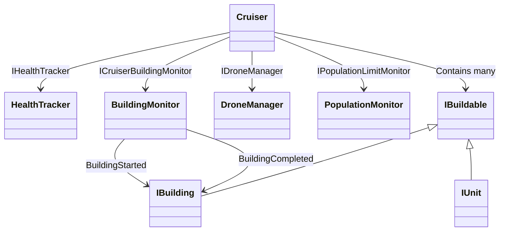
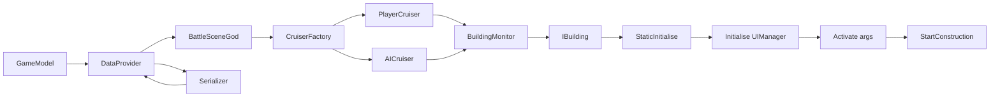
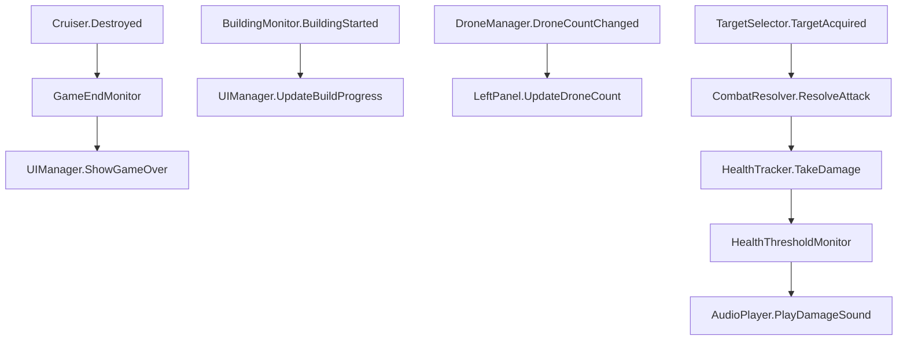

# Battlecruisers Architecture Guide

**Date:** October 22, 2025
**Project:** BattleCruisers - Comprehensive Software Architecture Overview
**Target Audience:** Software Engineers and Game Developers
**Purpose:** Provide detailed technical documentation enabling independent feature development and system understanding

Note (October 22, 2025): Updated with concise guidance for Firebase Analytics and IronSource integration, platform guards, consent gating, and resilient fallbacks. Additions preserve the interface-driven, modular design and avoid repetition.

---

## Executive Overview

BattleCruisers is a Unity-based real-time strategy (RTS) game where players construct and manage customizable battlecruisers equipped with various buildings and units. The gameplay revolves around tactical decision-making, resource management, drone-based building mechanics, and strategic combat against AI opponents.

This architecture guide provides a comprehensive technical breakdown of BattleCruisers' systems, enabling new developers to understand, extend, and modify the codebase without requiring access to the original source code. The guide focuses on:

- **System Architecture:** Detailed explanation of component relationships and data flow
- **Interface Usage:** How the codebase leverages interfaces for extensibility
- **Integration Points:** Where new features can be safely injected
- **Feature Implementation Patterns:** Proven approaches for common modifications
- **Debugging and Testing Strategies:** Methods for validating changes

---

## Core Architecture Philosophy

BattleCruisers employs a **highly modular, interface-driven architecture** where:

1. **Interfaces Define Contracts:** Nearly every major system is defined through interfaces (e.g., `IBattleSceneHelper`, `ICruiser`, `IBuildable`)
2. **Dependency Injection:** Components receive dependencies through constructors or initialization methods
3. **Event-Driven Communication:** Systems communicate through events rather than direct coupling
4. **Factory Pattern Usage:** Object creation is centralized through factory classes
5. **Composition Over Inheritance:** Complex behaviors are composed from simpler components

This design enables:
- **Easy Testing:** Mock implementations of interfaces for unit testing
- **Feature Isolation:** New features can be added without modifying existing code
- **Runtime Configuration:** Different implementations can be swapped based on game mode or settings
- **Maintainability:** Clear separation of concerns reduces coupling

---

## Table of Contents

1. [System Architecture Overview](#system-architecture-overview)
2. [Data Models and Persistence](#data-models-and-persistence)
3. [Battle Scene Management](#battle-scene-management)
4. [Cruiser and Buildable Systems](#cruiser-and-buildable-systems)
5. [AI and Strategy Systems](#ai-and-strategy-systems)
6. [User Interface Architecture](#user-interface-architecture)
7. [Save/Load and Progression](#saveload-and-progression)
8. [Analytics and Monetization Systems](#analytics-and-monetization-systems)
9. [Feature Integration Patterns](#feature-integration-patterns)
10. [Common Extension Points](#common-extension-points)
11. [Debugging and Testing](#debugging-and-testing)

---

## System Architecture Overview

### Core Design Principles

**1. Interface-First Design**
```csharp
// Example: IBattleSceneHelper defines the contract for mode-specific behavior
public interface IBattleSceneHelper
{
    IManagedDisposable CreateAI(Cruiser aiCruiser, Cruiser playerCruiser, int level);
    Loadout GetPlayerLoadout();
    bool ShowInGameHints { get; }
    IPrefabKey GetAiCruiserKey();
    // ... additional methods
}
```

**2. Factory Pattern for Object Creation**
```csharp
// Centralized object creation prevents tight coupling
public class CruiserFactory
{
    private readonly IBattleSceneHelper _helper;
    private readonly UIManager _uiManager;

    public CruiserFactory(IBattleSceneHelper helper, UIManager uiManager)
    {
        _helper = helper;
        _uiManager = uiManager;
    }

    public Cruiser CreatePlayerCruiser() { /* implementation */ }
    public Cruiser CreateAICruiser(IPrefabKey key) { /* implementation */ }
}
```

**3. Event-Driven Communication**
```csharp
// Systems communicate through events, not direct method calls
public class Cruiser
{
    public event EventHandler<DestroyedEventArgs> Destroyed;
    public event EventHandler BuildingCompleted;

    private void OnHealthGone()
    {
        Destroyed?.Invoke(this, new DestroyedEventArgs(this));
    }
}
```

**4. Battle Scene Scripting via BattleSequencer**
```csharp
// BattleSequencer.cs enables dynamic in-battle content control
public class BattleSequencer : MonoBehaviour
{
    public SequencePoint[] sequencePoints;

    // Can control:
    // - Building construction/destruction on specific cruiser slots
    // - Unit spawning at precise positions/timing
    // - Dynamic boost application/removal for cruisers
    // - Script execution at specific battle moments

    public async Task ProcessSequencePoint(SequencePoint sq)
    {
        // Handle building actions (Add/Destroy on specific slots)
        // Handle boost actions (Add/Remove/Replace)
        // Handle unit spawning (positioned or area-based)
        // Execute UnityEvents for custom logic
    }
}
```

## Common Pitfalls and Anti-Patterns

This section documents common mistakes discovered during development, particularly from the Endless Mode implementation. Understanding these pitfalls helps prevent architectural violations and ensures new features integrate smoothly.

### Pitfall 1: Violating Buildable Lifecycle

**Problem:** Incorrect order of operations during unit/building creation causes runtime failures.

**Anti-Pattern (Common Mistake):**
```csharp
var wrapper = UnityEngine.Object.Instantiate(prefab);
wrapper.gameObject.SetActive(true);    // ❌ Activates too early
wrapper.StaticInitialise();
unit.Activate(args);                   // ❌ Fails assertion in Buildable.cs
```

**Why It Fails:** `Activate()` expects the GameObject to be inactive (`Assert.IsFalse(_parent.activeSelf)` in Buildable.cs line 307).

**Correct Pattern:**
```csharp
var wrapper = UnityEngine.Object.Instantiate(prefab);
wrapper.gameObject.SetActive(false);   // ✅ Keep inactive until Activate()
wrapper.StaticInitialise();
unit.Initialise(uiManager);            // ✅ Don't forget this critical step!
unit.Activate(args);                   // ✅ Now it activates safely
```

**Lesson:** The buildable lifecycle is strict and enforced by assertions. Always follow the exact sequence.

### Pitfall 2: Forgetting Initialise(UIManager)

**Problem:** Units fail to initialize properly, causing null reference exceptions later.

**Anti-Pattern:**
```csharp
unit.StaticInitialise();
unit.Activate(activationArgs);  // ❌ Missing Initialise(UIManager) call
```

**Why It Fails:** `Initialise(UIManager)` sets up critical internal state. Without it, many properties are null, causing crashes when the unit tries to use them.

**Correct Pattern:**
```csharp
unit.StaticInitialise();          // Unity component setup
unit.Initialise(uiManager);       // ✅ Game logic initialization
unit.Activate(activationArgs);    // Activation and positioning
```

**Lesson:** Never skip the `Initialise(UIManager)` call - it's required for proper unit functionality.

### Pitfall 3: Assuming Buildings Follow Moving Cruisers

**Problem:** Buildings appear to float in mid-air when cruisers move (discovered in Endless Mode).

**Critical Misconception:**
```csharp
// Buildings are NOT children of cruiser in Unity hierarchy
cruiser.Position = Vector3.Lerp(startPos, homePos, t);  // ✅ Cruiser moves
// Buildings stay at original position - they don't follow!
```

**Why It Happens:** Buildings are independent GameObjects with their own transforms. Their positions are set once at creation time relative to the cruiser's position at that moment.

**Root Cause Evidence:**
```csharp
// Buildings are instantiated independently:
IBuilding building = Instantiate(buildingPrefab);
building.transform.position = cruiser.Position + slotOffset;  // Set once
// NOT: building.transform.SetParent(cruiser.transform);
```

**Solutions (Choose Based on Needs):**
1. **Keep cruisers stationary** - Simplest and most compatible
2. **Pre-build everything before movement** - Build first, then move
3. **Implement continuous position updates** - Update building positions every frame (performance cost)
4. **Make buildings children** - Parent them to cruiser transform (may break collision systems)

**Lesson:** Any feature involving moving cruisers must account for this fundamental limitation from the start.

### Pitfall 4: Trying to Access Protected Members

**Problem:** Attempting to force-complete units or access internal state.

**Anti-Pattern:**
```csharp
concreteUnit.BuildableState = BuildableState.Completed;  // ❌ Protected setter
concreteUnit.OnBuildableCompleted();                     // ❌ Protected method
unit.BuildProgress.Set(1.0f);                            // ❌ No such method
```

**Why It Fails:** These members are protected for good reason - they handle complex internal state management that external code shouldn't manipulate.

**Correct Approach:**
```csharp
unit.StartConstruction();  // ✅ Let normal construction flow handle completion
// Or accept that units need build time in your game mode
```

**Lesson:** Work with public interfaces. Don't fight the access modifiers - the architecture is designed this way for maintainability.

### Pitfall 5: Destroying Unity Prefab Assets

**Problem:** Attempting to destroy death explosion GameObjects causes Unity warnings.

**Anti-Pattern:**
```csharp
Destroy(deathExplosion.gameObject);  // ❌ "Destroying assets is not permitted"
```

**Why It Fails:** Unity distinguishes between scene instances (can be destroyed) and prefab assets (cannot be destroyed at runtime).

**Correct Pattern:**
```csharp
deathExplosion.gameObject.SetActive(false);  // ✅ Just hide it
```

**Lesson:** When unsure about object lifecycle, use `SetActive(false)` instead of `Destroy()`.

### Pitfall 6: Wrong Event Property Names

**Problem:** Incorrect property access on event arguments.

**Anti-Pattern:**
```csharp
private void OnBuildingStarted(object sender, BuildingStartedEventArgs e)
{
    IBuilding building = e.Building;  // ❌ Property doesn't exist
}
```

**Correct Pattern:**
```csharp
private void OnBuildingStarted(object sender, BuildingStartedEventArgs e)
{
    IBuilding building = e.StartedBuilding;  // ✅ Actual property name
}
```

**Event Args Property Pattern:**
```csharp
BuildingStartedEventArgs    → StartedBuilding
BuildingCompletedEventArgs  → CompletedBuilding
BuildingDestroyedEventArgs  → DestroyedBuilding
```

**Lesson:** Always check the actual property names on event arguments - they're not always what you'd expect.

### Pitfall 7: Namespace Ambiguities

**Problem:** Conflicting names between Unity and .NET namespaces.

**Anti-Pattern:**
```csharp
Random.Range(0, count);      // ❌ Ambiguous: UnityEngine.Random vs System.Random
Object.Instantiate(prefab);  // ❌ Ambiguous: UnityEngine.Object vs object
```

**Correct Pattern:**
```csharp
UnityEngine.Random.Range(0, count);     // ✅ Explicit qualification
UnityEngine.Object.Instantiate(prefab); // ✅ Explicit qualification
```

**Lesson:** When using common names, explicitly qualify them with the UnityEngine namespace.

### Pitfall 8: Incorrect BuildableActivationArgs Location

**Problem:** Wrong namespace for activation arguments.

**Anti-Pattern:**
```csharp
using BattleCruisers.Buildables;  // ❌ BuildableActivationArgs not here
```

**Correct Pattern:**
```csharp
using BattleCruisers.Buildables.Pools;  // ✅ BuildableActivationArgs lives here
```

**Lesson:** Check the actual namespace for types - they're not always where intuition suggests.

### Pitfall 9: Accessing Non-Existent Data Properties

**Problem:** Assuming models expose fields that don't exist (e.g., duration/score on `BattleResult`).

**Anti-Pattern:**
```csharp
FirebaseAnalyticsManager.Instance.LogLevelComplete(
    levelNumber: result.LevelNum,
    gameMode: ApplicationModel.Mode.ToString(),
    duration: result.TimeElapsed,  // ❌ not defined
    score: result.PlayerScore      // ❌ not defined
);
```

**Correct Pattern:** Use available data or proxies and plan extensions explicitly.
```csharp
FirebaseAnalyticsManager.Instance.LogLevelComplete(
    levelNumber: result.LevelNum,
    gameMode: ApplicationModel.Mode.ToString(),
    duration: 0f, // fallback
    score: (int)DataProvider.GameModel.LifetimeDestructionScore
);
```

**Lesson:** Verify model definitions before use; prefer composition or separate trackers over ad-hoc assumptions.

### Pitfall 10: Platform-Specific SDK Calls Without Guards

**Problem:** Initializing or calling third-party SDKs on unsupported platforms (Editor/iOS) causing failures.

**Correct Pattern:**
```csharp
#if UNITY_ANDROID && !UNITY_EDITOR
_ironSourceClass.CallStatic("init", appKey);
#else
Debug.Log("[Ads] Editor/unsupported platform simulation");
#endif
```

**Lesson:** Guard all platform-specific calls; simulate in Editor to keep flows testable.

### System Diagrams

#### Battle Initialization Flow
```mermaid
flowchart TD
    A[BattleSceneGod.Start()] --> B[CreateHelper()]
    B --> C{GameMode?}
    C -->|Endless| D[EndlessHelper]
    C -->|Campaign| E[NormalHelper]
    C -->|Tutorial| F[TutorialHelper]
    D --> G[Create CruiserFactory]
    E --> G
    F --> G
    G --> H[CreatePlayerCruiser()]
    G --> I[CreateAICruiser()]
    I --> J[CreateAI()]
    J --> K{Mode-Specific?}
    K -->|Endless| L[EndlessAIStrategy]
    K -->|Other| M[StandardAIStrategy]
    H --> N[Initialize UI Components]
    N --> O[Subscribe to Events]
    O --> P[Start Game Loop]
```

#### Cruiser Subsystem Composition


#### Data Flow Architecture


#### Event-Driven Communication


### Key Architectural Files

#### 1. **ApplicationModel.cs**
- **Location:** `Assets/Scripts/Data/ApplicationModel.cs`
- **Purpose:** Global game state container and mode management
- **Key Properties:**
  ```csharp
  public enum GameMode
  {
      Campaign = 1,
      Tutorial = 2,
      Skirmish = 3,
      PvP_1VS1 = 4,
      CoinBattle = 5,
      SideQuest = 6,
      Endless = 7  // Extensible for new modes
  }

  public static GameMode Mode { get; set; }
  public static int SelectedLevel { get; set; }
  public static Loadout PlayerLoadout { get; set; }
  ```

#### 2. **GameModel.cs**
- **Location:** `Assets/Scripts/Data/Models/GameModel.cs`
- **Purpose:** Complete player progression and inventory state
- **Key Features:**
  - **Currency Management:** Credits, coins, battle scores
  - **Unlock System:** Tracks unlocked hulls, buildings, units
  - **Progression Tracking:** Completed levels, side quests, achievements
  - **Inventory Management:** Purchased cosmetics, variants, captains
  - **Loadout Persistence:** Current ship configuration and selected items

#### 3. **Serializer.cs**
- **Location:** `Assets/Scripts/Data/Serializer.cs`
- **Purpose:** Game state persistence and cloud synchronization
- **Key Methods:**
  ```csharp
  public void SaveGame(GameModel game)  // Binary serialization to local file
  public GameModel LoadGame()           // Binary deserialization with compatibility handling
  public async Task CloudSave(GameModel game)  // JSON serialization to Unity Cloud Save
  public async Task<GameModel> CloudLoad(GameModel game)  // Cloud data loading and merging
  ```

---

## Data Models and Persistence

### GameModel Structure

The `GameModel` class serves as the central data repository for all player-related state:

```csharp
[Serializable]
public class GameModel
{
    // Currency and scoring
    private long _credits;
    private long _coins;
    private float _battleWinScore;
    private long _lifetimeDestructionScore;
    private long _bestDestructionScore;

    // Progression tracking
    private List<CompletedLevel> _completedLevels;
    private List<CompletedLevel> _completedSideQuests;
    private List<HullKey> _unlockedHulls;
    private List<BuildingKey> _unlockedBuildings;
    private List<UnitKey> _unlockedUnits;

    // Inventory and purchases
    private List<int> _purchasedExos;        // Captain cosmetics
    private List<int> _purchasedHeckles;     // Victory animations
    private List<int> _purchasedBodykits;    // Ship visual variants
    private List<int> _purchasedVariants;    // Additional cosmetics

    // Player configuration
    private Loadout _playerLoadout;
    private SettingsModel _settings;
    private string _playerName;

    // Game state
    private BattleResult _lastBattleResult;
    private int _selectedLevel;
    private bool _hasAttemptedTutorial;
}
```

### Loadout System

The `Loadout` class manages the player's current ship configuration:

```csharp
public class Loadout
{
    public Dictionary<BuildingCategory, List<BuildingKey>> SelectedBuildings { get; }
    public Dictionary<UnitCategory, List<UnitKey>> SelectedUnits { get; }
    public CaptainExoKey CurrentCaptain { get; set; }
    public List<int> SelectedVariants { get; set; }
    public List<int> CurrentHeckles { get; set; }

    // Methods for managing selections
    public void AddBuilding(BuildingCategory category, BuildingKey building) { }
    public void RemoveBuilding(BuildingCategory category, BuildingKey building) { }
    public bool SmartEquals(Loadout other) { }  // Deep equality comparison
}
```

### Serialization Architecture

**Binary Serialization (Local Save):**
```csharp
// Serializer.cs - Local file persistence
public void SaveGame(GameModel game)
{
    using (FileStream file = File.Create(gameModelFilePath))
    {
        _binaryFormatter.Serialize(file, game);
    }
}

public GameModel LoadGame()
{
    using (FileStream file = File.Open(gameModelFilePath, FileMode.Open))
    {
        object output = _binaryFormatter.Deserialize(file);
        return MakeCompatible(output);  // Handle version compatibility
    }
}
```

**JSON Serialization (Cloud Save):**
```csharp
// Cloud synchronization using Unity Services
public async Task CloudSave(GameModel game)
{
    SaveGameModel saveData = new SaveGameModel(game);
    var serializedData = SerializeGameModel(saveData);
    var data = new Dictionary<string, object> { { "GameModel", serializedData } };
    await CloudSaveService.Instance.Data.ForceSaveAsync(data);
}
```

**Compatibility Handling:**
The serializer includes sophisticated version compatibility handling:

```csharp
private GameModel MakeCompatible(object gameData)
{
    // Extract data using reflection to handle missing properties
    var tut = gameData.GetType().GetProperty("HasAttemptedTutorial").GetValue(gameData);
    var lds = gameData.GetType().GetProperty("LifetimeDestructionScore").GetValue(gameData);

    // Reconstruct GameModel with compatible defaults
    GameModel compatibleGameModel = new GameModel(
        _hasSyncdShop: false,
        _hasAttemptedTutorial: (bool)tut,
        _lifetimeDestructionScore: (long)lds,
        _bestDestructionScore: (long)bds,
        _loadout: (Loadout)plo,
        _lastBattleResult: (BattleResult)lbr,
        _unlockedHulls: _unlockedHulls,
        _unlockedBuildings: _unlockedBuildings,
        _unlockedUnits: _unlockedUnits
    );

    // Apply legacy data migration
    // ... complex migration logic for purchased items, completed levels, etc.
}
```

---

## Battle Scene Management

### BattleSceneGod Architecture

**Location:** `Assets/Scripts/Scenes/BattleScene/BattleSceneGod.cs`

The `BattleSceneGod` class is the central orchestrator for battle scenes, implementing a **highly structured initialization sequence**:

```csharp
public class BattleSceneGod : MonoBehaviour
{
    // Dependency injection through initialization
    private async void Start()
    {
        // 1. Component initialization
        components = GetComponent<BattleSceneGodComponents>();
        components.Initialise();

        // 2. Mode-specific helper creation
        IBattleSceneHelper helper = CreateHelper(components.Deferrer, navigationPermitters);

        // 3. Factory setup
        CruiserFactory cruiserFactory = new CruiserFactory(helper, uiManager);

        // 4. Cruiser creation and setup
        playerCruiser = cruiserFactory.CreatePlayerCruiser();
        aiCruiser = cruiserFactory.CreateAICruiser(helper.GetAiCruiserKey());

        // 5. AI initialization
        IManagedDisposable ai = helper.CreateAI(aiCruiser, playerCruiser, ApplicationModel.SelectedLevel);

        // 6. UI initialization
        LeftPanelComponents leftPanel = leftPanelInitialiser.Initialise(/* ... */);

        // 7. Event system setup
        _gameEndMonitor = new GameEndMonitor(/* ... */);

        // 8. Audio system initialization
        // 9. Visual effects setup
        // 10. Tutorial system (if applicable)
    }

    // Factory method for mode-specific helpers
    private IBattleSceneHelper CreateHelper(IDeferrer deferrer, NavigationPermitters navigationPermitters)
    {
        switch (ApplicationModel.Mode)
        {
            case GameMode.Tutorial:
                return new TutorialHelper(navigationPermitters);
            case GameMode.Campaign:
                return new NormalHelper(deferrer);
            case GameMode.Endless:
                return new EndlessHelper(deferrer);
            // ... additional cases
        }
    }
}
```

### Battle State Tracking and Analytics

**Battle Statistics Collection:**
```csharp
// BattleSceneGod.cs - Tracks comprehensive battle metrics
public static Dictionary<TargetType, DeadBuildableCounter> deadBuildables;

// Tracks damage dealt to different target types
deadBuildables = new Dictionary<TargetType, DeadBuildableCounter>();
deadBuildables.Add(TargetType.Aircraft, new DeadBuildableCounter());
deadBuildables.Add(TargetType.Ships, new DeadBuildableCounter());
deadBuildables.Add(TargetType.Cruiser, new DeadBuildableCounter());
deadBuildables.Add(TargetType.Buildings, new DeadBuildableCounter());
deadBuildables.Add(TargetType.PlayedTime, new DeadBuildableCounter()); // Battle duration
```

**Available Battle Metrics:**
- **Damage Totals:** By target type (Aircraft, Ships, Cruiser, Buildings)
- **Battle Duration:** Real time played (excludes paused/fast-forward time)
- **Unit Counts:** Number of units spawned by type
- **Building State:** Which buildings exist on which slots
- **Victory Conditions:** How and when the battle ended

**Battle State Limitations:**
- ⚠️ **No Battle State Preservation:** Battles cannot be paused and resumed in exact state
- ⚠️ **Final Results Only:** Only end-of-battle statistics are available
- ⚠️ **No Mid-Battle Save:** Cannot checkpoint battle progress

### Battle Scene Scripting with BattleSequencer

**Location:** `Assets/Scripts/Scenes/BattleScene/BattleSequencer.cs`

The `BattleSequencer` provides **powerful dynamic control** over battle scenes through scripted sequence points:

```csharp
public class BattleSequencer : MonoBehaviour
{
    public SequencePoint[] sequencePoints; // Unity-configured battle events

    public async void StartF()
    {
        // Process all sequence points in order
        foreach (SequencePoint sq in sequencePoints)
            await ProcessSequencePoint(sq);
    }
}

// Sequence Point Actions Available:
public class SequencePoint
{
    public int DelayMS = 0;           // Timing control
    public Faction Faction;           // Which cruiser (Player/Enemy)

    // Building Actions
    public List<BuildingAction> BuildingActions; // Add/Destroy buildings

    // Boost Actions
    public List<BoostAction> BoostActions;       // Add/Remove/Replace boosts

    // Unit Actions
    public List<UnitAction> UnitActions;         // Spawn units

    // Custom Logic
    public ScriptCallAction ScriptCallActions;   // UnityEvents for custom code
}
```

**Building Action Capabilities:**
```csharp
public class BuildingAction
{
    public enum BuildingOp { Add = 0, Destroy = 1 }
    public BuildingOp Operation;
    public PrefabKeyName PrefabKeyName;    // Which building to add
    public byte SlotID;                    // Which slot to use
    public bool IgnoreDroneReq = false;    // Bypass drone requirements
    public bool IgnoreBuildTime = false;   // Instant construction
}
```

**Boost Action Capabilities:**
```csharp
public class BoostAction
{
    public enum BoostOp { Add = 0, Remove = 1, Replace = 2 }
    public BoostOp Operation;
    public BoostType BoostType;      // Damage, FireRate, Accuracy, etc.
    public float BoostAmount = 1;    // Multiplier value
}
```

**Unit Action Capabilities:**
```csharp
public class UnitAction
{
    public PrefabKeyName PrefabKeyName; // Which unit to spawn
    public Vector2 Postion;             // Exact spawn position
    public Vector2 SpawnArea;           // Random area spawning
    public byte Amount = 1;             // How many to spawn
}
```

### Component-Based Architecture

BattleSceneGod uses composition to manage complex systems:

```csharp
// Separate components for different concerns
private BattleSceneGodComponents components;      // Core scene components
private CameraComponents cameraComponents;        // Camera and view management
private LeftPanelComponents leftPanelComponents;  // Build menu and drone management
private RightPanelComponents rightPanelComponents; // Game controls and menus

// Event-driven systems
private GameEndMonitor _gameEndMonitor;           // Battle completion detection
private CruiserDeathManager _cruiserDeathManager; // Death effects and cleanup
private LifetimeManager _lifetimeManager;         // Scene lifetime management
```

### Helper Pattern for Mode-Specific Behavior

Each game mode implements `IBattleSceneHelper`:

```csharp
public interface IBattleSceneHelper
{
    // AI creation
    IManagedDisposable CreateAI(Cruiser aiCruiser, Cruiser playerCruiser, int level);

    // Configuration methods
    Loadout GetPlayerLoadout();
    IPrefabKey GetAiCruiserKey();
    bool ShowInGameHints { get; }
    Level GetLevel();
    SideQuestData GetSideQuest();

    // UI and audio configuration
    UIManager CreateUIManager();
    ButtonVisibilityFilters CreateButtonVisibilityFilters(IDroneManager droneManager);

    // Async operations
    Task<string> GetEnemyNameAsync(int levelNum);
    Task<PrefabContainer<BackgroundImageStats>> GetBackgroundStatsAsync(int levelNum);
}
```

**Example Implementation:**
```csharp
public class EndlessHelper : BattleSceneHelper
{
    private readonly IDeferrer _deferrer;

    public EndlessHelper(IDeferrer deferrer)
    {
        _deferrer = deferrer;
    }

    public override IManagedDisposable CreateAI(Cruiser aiCruiser, Cruiser playerCruiser, int level)
    {
        // Custom AI strategy for endless mode
        return new EndlessAIStrategy(aiCruiser, playerCruiser, level);
    }

    public override bool ShowInGameHints => false;  // Disable tutorials in endless mode

    // ... additional overrides
}
```

---

## Cruiser and Buildable Systems

### Cruiser Architecture

Cruisers are complex entities composed of multiple subsystems with **comprehensive boost/perk systems**:

```csharp
public class Cruiser : MonoBehaviour, ICruiser
{
    // Core properties
    public string Name { get; }
    public Sprite Sprite { get; }
    public float YAdjustmentInM { get; }
    public bool IsDestroyed { get; }

    // Position and movement
    public Vector3 Position { get; set; }
    public Quaternion Rotation { get; set; }

    // Combat and health
    public IHealthTracker HealthTracker { get; }
    public ICruiserDamageMonitor DamageMonitor { get; }

    // Building and construction
    public ICruiserBuildingMonitor BuildingMonitor { get; }
    public IDroneManager DroneManager { get; }
    public IPopulationLimitMonitor PopulationLimitMonitor { get; }

    // Events
    public event EventHandler<DestroyedEventArgs> Destroyed;
    public event EventHandler BuildingCompleted;
}
```

### Cruiser Boost and Perk System

**Boost Architecture:**
```csharp
// Cruiser.cs - Dynamic boost management
[Serializable]
public class BoostStats
{
    public BoostType boostType;     // Type of boost (Damage, FireRate, etc.)
    public float boostAmount = 1f;  // Multiplier value
}

public class Cruiser : MonoBehaviour, ICruiser
{
    public List<BoostStats> Boosts;                    // Active boosts
    List<IBoostProvider> BoostsProvided = new List<IBoostProvider>();

    // Dynamic boost management
    public void AddBoost(BoostStats boost)
    {
        Boosts.Add(boost);
        IBoostProvider boostProvider = new BoostProvider(boost.boostAmount);
        BoostsProvided.Add(boostProvider);

        // Apply to global boost system
        CruiserSpecificFactories.GlobalBoostProviders
            .BoostTypeToBoostProvider(boost.boostType)
            .Add(boostProvider);
    }

    public void RemoveBoost(BoostStats boost)
    {
        // Find and remove matching boost
        for(int i = 0; i < Boosts.Count; i++)
        {
            if(Boosts[i].boostType == boost.boostType)
            {
                Boosts.RemoveAt(i);
                CruiserSpecificFactories.GlobalBoostProviders
                    .BoostTypeToBoostProvider(boost.boostType)
                    .Remove(BoostsProvided[i]);
                BoostsProvided.RemoveAt(i);
                break;
            }
        }
    }
}
```

**Available Boost Types:**
```csharp
public enum BoostType
{
    Damage,           // Increases damage output
    FireRate,         // Increases firing speed
    Accuracy,         // Improves targeting accuracy
    Range,            // Extends attack range
    Health,           // Increases health pool
    BuildSpeed,       // Faster construction
    DroneCapacity,    // More drones available
    // ... additional boost types
}
```

**Boost Application Example:**
```csharp
// BoostedTurretStats.cs - How boosts affect turret performance
public class BoostedTurretStats : BoostedBasicTurretStats<ITurretStats>, ITurretStats
{
    private readonly IBoostable _accuracyBoostable;
    private readonly IBoostableGroup _accuracyBoostableGroup;

    public float Accuracy => Mathf.Clamp01(_accuracyBoostable.BoostMultiplier * _baseStats.Accuracy);
    public float FireRate => _fireRateBoostable.BoostMultiplier * _baseStats.FireRate;

    // Boosts are applied through IBoostable interfaces
    // Changes propagate automatically through the boost system
}
```

**Boost Persistence and Application:**
- **Runtime:** Boosts applied immediately through `AddBoost()`/`RemoveBoost()`
- **Initialization:** Boosts loaded from `Cruiser.Boosts` list during cruiser setup
- **Global System:** Boosts affect all buildings/units through `GlobalBoostProviders`
- **Stacking:** Multiple boosts of same type combine multiplicatively

### Buildable System

Buildables follow a **strict lifecycle pattern**:

```csharp
public interface IBuildable
{
    // Lifecycle methods
    void StaticInitialise();                    // Unity component setup
    void Initialise(UIManager uiManager);       // Game logic initialization
    void Activate(BuildableActivationArgs args); // Activation and positioning
    void StartConstruction();                   // Begin building process

    // Properties
    Vector3 Position { get; set; }
    Quaternion Rotation { get; set; }
    BuildableState BuildableState { get; }
    float BuildProgress { get; }

    // Events
    event EventHandler<BuildableCompletedEventArgs> CompletedBuildable;
    event EventHandler<BuildableDestroyedEventArgs> DestroyedBuildable;
}
```

**Buildable Categories:**
```csharp
public enum BuildingCategory
{
    Factory,    // Production buildings (Air/Naval/Drone factories)
    Defence,    // Defensive turrets and shields
    Offence,    // Offensive weapons and turrets
    Tactical,   // Support buildings (shields, boosters)
    Ultra       // Special high-power buildings (nukes, kamikaze)
}

public enum UnitCategory
{
    Aircraft,   // Planes and helicopters
    Naval       // Ships and submarines
}
```

**Buildable Lifecycle Example:**
```csharp
// 1. Prefab instantiation (inactive)
var wrapper = UnityEngine.Object.Instantiate(prefab);
wrapper.gameObject.SetActive(false);  // CRITICAL: Must be inactive

// 2. Static initialization
wrapper.StaticInitialise();           // Sets up Unity components
IUnit unit = wrapper.Buildable;

// 3. Game logic initialization
unit.Initialise(uiManager);           // Sets up internal state

// 4. Positioning (before activation)
unit.Position = spawnPosition;
unit.Rotation = spawnRotation;

// 5. Activation (makes GameObject active)
unit.Activate(new BuildableActivationArgs(parentCruiser, enemyCruiser, factories));

// 6. Construction start
unit.StartConstruction();             // Begins build timer
```

### Factory Pattern for Object Creation

**CruiserFactory:**
```csharp
public class CruiserFactory
{
    private readonly IBattleSceneHelper _helper;
    private readonly UIManager _uiManager;

    public Cruiser CreatePlayerCruiser()
    {
        // Load player cruiser based on GameModel.PlayerLoadout
        HullKey hullKey = _helper.GetPlayerLoadout().CurrentHull;
        Cruiser cruiser = InstantiateCruiser(hullKey);

        // Initialize subsystems
        InitializeCruiserSystems(cruiser, isPlayer: true);
        return cruiser;
    }

    public Cruiser CreateAICruiser(IPrefabKey hullKey)
    {
        Cruiser cruiser = InstantiateCruiser(hullKey);
        InitializeCruiserSystems(cruiser, isPlayer: false);

        // AI-specific setup
        cruiser.AdjustStatsByDifficulty(_helper.GetDifficulty());
        return cruiser;
    }
}
```

**PrefabFactory:**
```csharp
public static class PrefabFactory
{
    // Centralized prefab loading and pooling
    public static IBuildableWrapper<IBuilding> GetBuildingWrapperPrefab(BuildingKey key) { }
    public static IBuildableWrapper<IUnit> GetUnitWrapperPrefab(UnitKey key) { }
    public static CaptainExo GetCaptainExo(CaptainExoKey key) { }

    // Pool management for performance
    public static void CreatePools() { }
}
```

---

## AI and Strategy Systems

### AI Architecture

AI systems are designed for **modularity and extensibility**:

```csharp
public interface IAIStrategy : IManagedDisposable
{
    void UpdateStrategy();                    // Called each frame
    void OnPlayerAction(PlayerAction action); // Respond to player input
    void OnBuildingCompleted(IBuilding building); // Respond to construction
}

public class EndlessAIStrategy : IAIStrategy
{
    private readonly Cruiser _aiCruiser;
    private readonly Cruiser _playerCruiser;

    public EndlessAIStrategy(Cruiser aiCruiser, Cruiser playerCruiser, int waveNumber)
    {
        _aiCruiser = aiCruiser;
        _playerCruiser = playerCruiser;

        // Initialize AI state based on wave number and player strength
        InitializeStrategyForWave(waveNumber);
    }

    public void UpdateStrategy()
    {
        // Analyze battlefield state
        AnalyzeThreats();
        PrioritizeTargets();

        // Make tactical decisions
        DecideBuildingConstruction();
        DecideUnitProduction();
        DecideAggressionLevel();
    }
}
```

### Targeting and Combat Systems

**Target Selection:**
```csharp
public interface ITargetSelector
{
    ITarget SelectOptimalTarget(IEnumerable<ITarget> availableTargets);
    void UpdateTargetPriorities();
}

public class AdaptiveTargetSelector : ITargetSelector
{
    private readonly Dictionary<TargetType, float> _priorityWeights;

    public ITarget SelectOptimalTarget(IEnumerable<ITarget> availableTargets)
    {
        return availableTargets
            .OrderByDescending(target => CalculateTargetScore(target))
            .FirstOrDefault();
    }

    private float CalculateTargetScore(ITarget target)
    {
        float baseScore = _priorityWeights[target.TargetType];
        float distanceFactor = CalculateDistanceFactor(target);
        float threatFactor = CalculateThreatFactor(target);

        return baseScore * distanceFactor * threatFactor;
    }
}
```

**Combat Resolution:**
```csharp
public interface ICombatResolver
{
    void ResolveAttack(ICombatant attacker, ITarget target, float damage);
    void ApplyDamageEffects(IDamageable target, DamageInfo damage);
}

public class StandardCombatResolver : ICombatResolver
{
    public void ResolveAttack(ICombatant attacker, ITarget target, float damage)
    {
        // Calculate hit probability, armor penetration, etc.
        float actualDamage = CalculateEffectiveDamage(attacker, target, damage);

        // Apply damage and effects
        target.TakeDamage(actualDamage, attacker, ignoreImmuneStatus: false);
    }
}
```

---

## User Interface Architecture

### UIManager and Component System

The UI system is **highly composable and event-driven**:

```csharp
public class UIManager
{
    // Component references
    private readonly LeftPanelComponents _leftPanel;
    private readonly RightPanelComponents _rightPanel;
    private readonly TopPanelComponents _topPanel;

    // Event subscriptions
    private readonly Dictionary<string, Action<object>> _eventHandlers;

    public void InitializeUI()
    {
        // Setup event subscriptions
        SubscribeToCruiserEvents();
        SubscribeToBuildableEvents();
        SubscribeToGameStateEvents();
    }

    public void UpdateUIForGameMode(GameMode mode)
    {
        // Mode-specific UI configuration
        switch (mode)
        {
            case GameMode.Endless:
                ConfigureEndlessModeUI();
                break;
            case GameMode.Tutorial:
                ConfigureTutorialUI();
                break;
        }
    }
}
```

### Panel Component Architecture

**LeftPanelComponents (Build Menu):**
```csharp
public class LeftPanelComponents
{
    public BuildMenu BuildMenu { get; }
    public DroneManagerMonitor DroneMonitor { get; }
    public BuildableButtons BuildableButtons { get; }

    public LeftPanelComponents Initialize(
        IDroneManager droneManager,
        DroneManagerMonitor droneMonitor,
        UIManager uiManager,
        Loadout playerLoadout,
        /* ... additional dependencies */)
    {
        // Initialize build menu with available buildings
        BuildMenu.Initialize(playerLoadout.SelectedBuildings);

        // Setup drone monitoring
        DroneMonitor.Initialize(droneManager);

        // Configure buildable buttons
        BuildableButtons.Initialize(uiManager, playerLoadout);

        return this;
    }
}
```

**RightPanelComponents (Game Controls):**
```csharp
public class RightPanelComponents
{
    public MainMenuManager MainMenuManager { get; }
    public SpeedComponents SpeedControls { get; }
    public InformatorPanel InfoPanel { get; }

    public RightPanelComponents Initialize(
        UIManager uiManager,
        Cruiser playerCruiser,
        IUserChosenTargetHelper targetHelper,
        /* ... */)
    {
        // Setup main menu (pause, settings, etc.)
        MainMenuManager.Initialize(uiManager);

        // Configure speed controls
        SpeedControls.Initialize(playerCruiser);

        // Setup information panel
        InfoPanel.Initialize(targetHelper);

        return this;
    }
}
```

### Event-Driven UI Updates

UI updates are driven by **domain events** rather than polling:

```csharp
// In BattleSceneGod.Start()
helper.InitialiseUIManager(
    playerCruiser,
    aiCruiser,
    leftPanelComponents.BuildMenu,
    itemDetailsManager,
    FactoryProvider.Sound.IPrioritisedSoundPlayer,
    FactoryProvider.Sound.UISoundPlayer);

// Event subscription pattern
private void SubscribeToCruiserEvents()
{
    playerCruiser.Destroyed += OnPlayerCruiserDestroyed;
    playerCruiser.BuildingMonitor.BuildingStarted += OnBuildingStarted;
    playerCruiser.DroneManager.DroneCountChanged += OnDroneCountChanged;
}

// Event handlers update UI state
private void OnPlayerCruiserDestroyed(object sender, DestroyedEventArgs e)
{
    _uiManager.ShowGameOverScreen(playerWon: false);
}
```

---

## Analytics and Monetization Systems

### Analytics Architecture

Analytics is optional and pluggable via `IAnalyticsManager`. Keep gameplay code decoupled by logging through a provider facade.

```csharp
public interface IAnalyticsManager
{
    Task InitializeAsync();
    void LogEvent(string eventName, Dictionary<string, object> parameters = null);
    void LogLevelStart(int levelNumber, string levelName, string gameMode);
    void LogLevelComplete(int levelNumber, string gameMode, float duration, int score);
    void LogLevelFail(int levelNumber, string gameMode, float duration, string failReason);
}
```

Integration points:
- `LandingSceneGod` – session/start funnels and progression.
- `PostBattleScreenController` – victory/failure outcomes.

Guidelines:
- Use fallbacks when specific metrics are unavailable (e.g., duration=0, score from `LifetimeDestructionScore`).
- Gate initialization with consent and platform readiness.

### Monetization Architecture

Ads integrate via `IMediationManager` with Editor simulation.

```csharp
public interface IMediationManager
{
    Task InitializeAsync(string appKey);
    bool IsInterstitialReady();
    void ShowInterstitial();
    event Action OnInterstitialAdClosed;
}
```

Guidelines:
- Guard all SDK calls with `#if UNITY_ANDROID && !UNITY_EDITOR`.
- Skip ads for premium users; respect GDPR consent.
- Drive UI flows with events (e.g., close callbacks resume UI).

---

## Save/Load and Progression

### DataProvider Singleton

The `DataProvider` class serves as the **central data access point**:

```csharp
public static class DataProvider
{
    private static GameModel _gameModel;
    private static Serializer _serializer;

    public static GameModel GameModel
    {
        get => _gameModel ?? LoadOrCreateGameModel();
        set => _gameModel = value;
    }

    private static GameModel LoadOrCreateGameModel()
    {
        if (_serializer.DoesSavedGameExist())
        {
            return _serializer.LoadGame();
        }
        else
        {
            return StaticData.InitialGameModel;
        }
    }

    public static void SaveGame() => _serializer.SaveGame(GameModel);

    public static async Task SyncWithCloud()
    {
        await _serializer.CloudSave(GameModel);
        await _serializer.SyncCurrencyFromCloud();
        await _serializer.SyncInventoryFromCloud();
    }
}
```

### Progression System

**Level Completion Tracking:**
```csharp
public class CompletedLevel
{
    public int LevelNum { get; }
    public Difficulty HardestDifficulty { get; set; }
    public DateTime CompletedAt { get; }

    public CompletedLevel(int levelNum, Difficulty difficulty)
    {
        LevelNum = levelNum;
        HardestDifficulty = difficulty;
        CompletedAt = DateTime.UtcNow;
    }
}
```

### Battle Result Analysis System

**Battle Statistics Available:**
```csharp
// BattleSceneGod.cs - Comprehensive battle tracking
public static Dictionary<TargetType, DeadBuildableCounter> deadBuildables;

// Contains damage totals by category:
deadBuildables[TargetType.Aircraft].GetTotalDamageInCredits();    // Player damage to enemy aircraft
deadBuildables[TargetType.Ships].GetTotalDamageInCredits();      // Player damage to enemy ships
deadBuildables[TargetType.Cruiser].GetTotalDamageInCredits();    // Player damage to enemy cruiser
deadBuildables[TargetType.Buildings].GetTotalDamageInCredits();  // Player damage to enemy buildings
deadBuildables[TargetType.PlayedTime].GetPlayedTime();           // Battle duration in seconds

// DestructionSceneGod.cs processes these into rewards:
private void PopulateScreen()
{
    // Get damage values from battle results
    aircraftVal = BattleSceneGod.deadBuildables[TargetType.Aircraft].GetTotalDamageInCredits();
    shipsVal = BattleSceneGod.deadBuildables[TargetType.Ships].GetTotalDamageInCredits();
    cruiserVal = BattleSceneGod.deadBuildables[TargetType.Cruiser].GetTotalDamageInCredits();
    buildingsVal = BattleSceneGod.deadBuildables[TargetType.Buildings].GetTotalDamageInCredits();
    levelTimeInSeconds = BattleSceneGod.deadBuildables[TargetType.PlayedTime].GetPlayedTime();
}
```

**Battle Duration Tracking:**
```csharp
// Accurate battle time (excludes pause/fast-forward)
private void Update()
{
    if (!isPaused && !isFastForward)
    {
        float dt = Time.deltaTime;
        deadBuildables?[TargetType.PlayedTime]?.AddPlayedTime(dt);
    }
}
```

**Unit and Building Tracking Limitations:**
- **Final State Only:** Only tracks destroyed units/buildings, not active ones
- **No Slot Information:** Cannot determine which buildings were on which slots
- **No Construction Progress:** Cannot tell if buildings were completed or in-progress
- **Aggregate Only:** Cannot distinguish between different unit types in damage totals

// In GameModel.cs
public void AddCompletedLevel(CompletedLevel completedLevel)
{
    Assert.IsTrue(completedLevel.LevelNum <= _completedLevels.Count + 1,
                  "Have not completed preceding level");

    if (completedLevel.LevelNum > _completedLevels.Count)
    {
        // First time completion - add new entry
        _completedLevels.Add(completedLevel);

        // Unlock rewards (new buildings, units, etc.)
        UnlockLevelRewards(completedLevel.LevelNum);
    }
    else
    {
        // Replay - update difficulty if better
        CompletedLevel existing = _completedLevels[completedLevel.LevelNum - 1];
        if (completedLevel.HardestDifficulty > existing.HardestDifficulty)
        {
            existing.HardestDifficulty = completedLevel.HardestDifficulty;
        }
    }
}
```

**Unlock System:**
```csharp
public void AddUnlockedBuilding(BuildingKey building)
{
    if (!_unlockedBuildings.Contains(building))
    {
        _unlockedBuildings.Add(building);
        NewBuildings.AddItem(building);  // Trigger "new item" notification
    }
}

public void AddUnlockedUnit(UnitKey unit)
{
    if (!_unlockedUnits.Contains(unit))
    {
        _unlockedUnits.Add(unit);
        NewUnits.AddItem(unit);
    }
}
```

---

## Feature Integration Patterns

### Pattern 1: Pre-Built Buildables Feature

**Implementation Strategy:**

1. **Extend Loadout System:**
```csharp
public class Loadout
{
    // Add pre-built configuration
    public Dictionary<BuildingCategory, List<PreBuiltBuilding>> PreBuiltBuildings { get; set; }

    public class PreBuiltBuilding
    {
        public BuildingKey BuildingKey { get; }
        public int SlotIndex { get; }
        public float BuildProgress { get; }  // 0.0 to 1.0
    }
}
```

2. **Create Pre-Build System:**
```csharp
public class PreBuildSystem : MonoBehaviour
{
    public void InitializePreBuiltBuildings(Cruiser cruiser, Loadout loadout)
    {
        foreach (var category in loadout.PreBuiltBuildings)
        {
            foreach (var preBuilt in category.Value)
            {
                if (preBuilt.BuildProgress > 0)
                {
                    // Create building and set progress
                    IBuilding building = CreateBuildingInSlot(cruiser, preBuilt);
                    SetBuildingProgress(building, preBuilt.BuildProgress);
                }
            }
        }
    }
}
```

3. **Integration Point:**
```csharp
// In BattleSceneGod.Start() - after cruiser creation
if (ApplicationModel.Mode == GameMode.YourNewMode)
{
    PreBuildSystem preBuildSystem = gameObject.AddComponent<PreBuildSystem>();
    preBuildSystem.InitializePreBuiltBuildings(playerCruiser, helper.GetPlayerLoadout());
}
```

### Pattern 2: Persistent Perks Between Battles

**Implementation Strategy:**

1. **Extend GameModel:**
```csharp
public class GameModel
{
    private List<BattlePerk> _activePerks;
    public IReadOnlyList<BattlePerk> ActivePerks => _activePerks.AsReadOnly();

    public void AddPerk(BattlePerk perk)
    {
        if (!_activePerks.Contains(perk))
        {
            _activePerks.Add(perk);
        }
    }

    public void RemovePerk(BattlePerk perk)
    {
        _activePerks.Remove(perk);
    }
}
```

2. **Create Perk System:**
```csharp
public abstract class BattlePerk
{
    public string PerkId { get; }
    public string DisplayName { get; }
    public abstract void ApplyToCruiser(Cruiser cruiser);
    public abstract void RemoveFromCruiser(Cruiser cruiser);
}

public class DamageBoostPerk : BattlePerk
{
    private float _damageMultiplier;

    public override void ApplyToCruiser(Cruiser cruiser)
    {
        cruiser.DamageMultiplier *= _damageMultiplier;
    }

    public override void RemoveFromCruiser(Cruiser cruiser)
    {
        cruiser.DamageMultiplier /= _damageMultiplier;
    }
}
```

3. **Integration with Battle Initialization:**
```csharp
// In BattleSceneGod.Start() - after cruiser creation
foreach (BattlePerk perk in DataProvider.GameModel.ActivePerks)
{
    perk.ApplyToCruiser(playerCruiser);
}
```

### Pattern 3: Dynamic Unit Spawning During Battle

**Implementation Strategy:**

1. **Create Spawn System:**
```csharp
public class DynamicUnitSpawner : MonoBehaviour
{
    private readonly List<UnitSpawnRule> _spawnRules;
    private Cruiser _ownerCruiser;
    private Cruiser _enemyCruiser;

    public void Initialize(Cruiser ownerCruiser, Cruiser enemyCruiser)
    {
        _ownerCruiser = ownerCruiser;
        _enemyCruiser = enemyCruiser;

        // Setup spawn rules based on game mode requirements
        _spawnRules.Add(new UnitSpawnRule
        {
            TriggerCondition = SpawnTrigger.PlayerHealthLow,
            SpawnUnits = new[] { StaticPrefabKeys.Units.Gunship },
            SpawnDelay = TimeSpan.FromSeconds(30),
            Cooldown = TimeSpan.FromSeconds(60)  // Prevent spam
        });

        _spawnRules.Add(new UnitSpawnRule
        {
            TriggerCondition = SpawnTrigger.TimeElapsed,
            SpawnUnits = new[] { StaticPrefabKeys.Units.AttackBoat },
            SpawnDelay = TimeSpan.FromSeconds(45),
            TriggerTime = TimeSpan.FromMinutes(2)  // Spawn after 2 minutes
        });
    }

    private void Update()
    {
        foreach (var rule in _spawnRules)
        {
            if (rule.ShouldTrigger(_ownerCruiser, _enemyCruiser))
            {
                SpawnUnits(rule.SpawnUnits, _ownerCruiser);
                rule.LastTriggered = DateTime.UtcNow;  // Set cooldown
            }
        }
    }

    private void SpawnUnits(UnitKey[] unitKeys, Cruiser owner)
    {
        foreach (var unitKey in unitKeys)
        {
            // Follow exact unit creation lifecycle
            var wrapperPrefab = PrefabFactory.GetUnitWrapperPrefab(unitKey);
            var wrapper = UnityEngine.Object.Instantiate(wrapperPrefab.UnityObject);
            wrapper.gameObject.SetActive(false);

            wrapper.StaticInitialise();
            var unit = wrapper.Buildable;

            unit.Initialise(_uiManager);

            // Set spawn position off-screen
            unit.Position = new Vector3(100f, UnityEngine.Random.Range(-5f, 5f), 0f);

            var rotation = unit.Rotation;
            rotation.eulerAngles = new Vector3(0, 180, 0);  // Face left
            unit.Rotation = rotation;

            var activationArgs = new BuildableActivationArgs(owner, _enemyCruiser, owner.CruiserSpecificFactories);
            unit.Activate(activationArgs);

            unit.StartConstruction();
        }
    }
}

public class UnitSpawnRule
{
    public SpawnTrigger TriggerCondition { get; set; }
    public UnitKey[] SpawnUnits { get; set; }
    public TimeSpan SpawnDelay { get; set; }
    public TimeSpan Cooldown { get; set; } = TimeSpan.FromSeconds(30);
    public TimeSpan TriggerTime { get; set; } = TimeSpan.Zero;
    public DateTime LastTriggered { get; set; } = DateTime.MinValue;

    public bool ShouldTrigger(Cruiser owner, Cruiser enemy)
    {
        var now = DateTime.UtcNow;
        if (now - LastTriggered < Cooldown) return false;

        return TriggerCondition switch
        {
            SpawnTrigger.PlayerHealthLow => owner.HealthTracker.Health < owner.HealthTracker.MaxHealth * 0.3f,
            SpawnTrigger.TimeElapsed => (now - BattleStartTime).TotalSeconds >= TriggerTime.TotalSeconds,
            SpawnTrigger.EnemyBuildingCount => enemy.BuildingMonitor.GetBuildingCount() >= 5,
            _ => false
        };
    }
}

public enum SpawnTrigger
{
    PlayerHealthLow,
    TimeElapsed,
    EnemyBuildingCount
}
```

2. **Integration Point:**
```csharp
// In BattleSceneGod.Start() - after cruiser creation
if (ApplicationModel.Mode == GameMode.YourNewMode)
{
    DynamicUnitSpawner spawner = gameObject.AddComponent<DynamicUnitSpawner>();
    spawner.Initialize(playerCruiser, aiCruiser);
}
```

3. **Testing and Validation:**
```csharp
// Test the spawn system
[Test]
public async Task TestDynamicSpawning()
{
    var spawner = new GameObject().AddComponent<DynamicUnitSpawner>();

    // Mock cruisers with low health
    var mockOwner = CreateMockCruiser(healthPercentage: 0.2f);
    var mockEnemy = CreateMockCruiser(healthPercentage: 1.0f);

    spawner.Initialize(mockOwner, mockEnemy);

    // Wait for spawn trigger
    await Task.Delay(100);

    // Verify units were spawned (check scene or mock collections)
    Assert.IsTrue(SpawnedUnitCount > 0);
}
```

### Pattern 4: Wave-Based Survival Mode (Advanced Example)

**Complete Tutorial: Adding Wave-Based Survival Mode**

1. **Update GameMode Enum:**
```csharp
// ApplicationModel.cs
public enum GameMode
{
    // ... existing modes
    WaveSurvival = 8
}
```

2. **Create Mode-Specific Helper:**
```csharp
// WaveSurvivalHelper.cs
public class WaveSurvivalHelper : BattleSceneHelper
{
    private readonly IDeferrer _deferrer;

    public WaveSurvivalHelper(IDeferrer deferrer)
    {
        _deferrer = deferrer;
    }

    public override IManagedDisposable CreateAI(Cruiser aiCruiser, Cruiser playerCruiser, int level)
    {
        return new WaveAIStrategy(aiCruiser, playerCruiser, level);
    }

    public override bool ShowInGameHints => false;

    public override Loadout GetPlayerLoadout()
    {
        // Custom loadout for survival mode - maybe more defensive buildings
        var loadout = base.GetPlayerLoadout();
        // Modify for survival-specific needs
        return loadout;
    }
}
```

3. **Create Wave Management System:**
```csharp
public class WaveManager : MonoBehaviour
{
    private Cruiser _playerCruiser;
    private Cruiser _aiCruiser;
    private int _currentWave = 1;
    private float _waveStartTime;
    private List<WaveDefinition> _waves;

    public void Initialize(Cruiser playerCruiser, Cruiser aiCruiser)
    {
        _playerCruiser = playerCruiser;
        _aiCruiser = aiCruiser;

        // Define waves
        _waves = new List<WaveDefinition>
        {
            new WaveDefinition
            {
                WaveNumber = 1,
                UnitsToSpawn = new[] { StaticPrefabKeys.Units.Gunship, StaticPrefabKeys.Units.AttackBoat },
                SpawnCount = 3,
                SpawnDelay = 5f,
                AiAggressionLevel = 0.5f
            },
            new WaveDefinition
            {
                WaveNumber = 2,
                UnitsToSpawn = new[] { StaticPrefabKeys.Units.Destroyer, StaticPrefabKeys.Units.Fighter },
                SpawnCount = 5,
                SpawnDelay = 3f,
                AiAggressionLevel = 0.7f
            }
            // ... additional waves
        };

        StartNextWave();
    }

    private void Update()
    {
        var waveDefinition = _waves.FirstOrDefault(w => w.WaveNumber == _currentWave);
        if (waveDefinition != null && Time.time - _waveStartTime >= waveDefinition.SpawnDelay)
        {
            SpawnWaveUnits(waveDefinition);
            _currentWave++;
            StartNextWave();
        }
    }

    private void SpawnWaveUnits(WaveDefinition wave)
    {
        for (int i = 0; i < wave.SpawnCount; i++)
        {
            var unitKey = wave.UnitsToSpawn[UnityEngine.Random.Range(0, wave.UnitsToSpawn.Length)];
            SpawnUnit(unitKey, _aiCruiser);
        }
    }

    private void SpawnUnit(UnitKey unitKey, Cruiser owner)
    {
        // Follow exact unit creation lifecycle (see Pitfall 1)
        var wrapperPrefab = PrefabFactory.GetUnitWrapperPrefab(unitKey);
        var wrapper = UnityEngine.Object.Instantiate(wrapperPrefab.UnityObject);
        wrapper.gameObject.SetActive(false);

        wrapper.StaticInitialise();
        var unit = wrapper.Buildable;

        unit.Initialise(_uiManager);

        // Position off-screen to the right
        unit.Position = new Vector3(100f, UnityEngine.Random.Range(-5f, 5f), 0f);

        var rotation = unit.Rotation;
        rotation.eulerAngles = new Vector3(0, 180, 0);
        unit.Rotation = rotation;

        var activationArgs = new BuildableActivationArgs(owner, _playerCruiser, owner.CruiserSpecificFactories);
        unit.Activate(activationArgs);

        unit.StartConstruction();
    }

    private void StartNextWave()
    {
        if (_currentWave <= _waves.Count)
        {
            _waveStartTime = Time.time;
            Debug.Log($"Starting wave {_currentWave}");
        }
        else
        {
            // Game completed - all waves done
            Debug.Log("All waves completed!");
        }
    }
}

public class WaveDefinition
{
    public int WaveNumber { get; set; }
    public UnitKey[] UnitsToSpawn { get; set; }
    public int SpawnCount { get; set; }
    public float SpawnDelay { get; set; }
    public float AiAggressionLevel { get; set; }
}
```

4. **Integrate in BattleSceneGod:**
```csharp
// BattleSceneGod.cs - Update CreateHelper()
case GameMode.WaveSurvival:
    return new WaveSurvivalHelper(deferrer);

// Add to Start() method:
if (ApplicationModel.Mode == GameMode.WaveSurvival)
{
    var waveManager = gameObject.AddComponent<WaveManager>();
    waveManager.Initialize(playerCruiser, aiCruiser);
}
```

5. **Testing Strategy:**
```csharp
[Test]
public async Task TestWaveSurvivalMode()
{
    ApplicationModel.Mode = GameMode.WaveSurvival;

    var battleScene = new GameObject().AddComponent<BattleSceneGod>();
    // Setup dependencies...

    await Task.Delay(1000); // Let waves start

    // Verify wave progression
    Assert.IsTrue(_currentWave >= 1);
    Assert.IsTrue(SpawnedUnitCount > 0);
}
```

### Pattern 5: Integrating Third-Party Analytics (Firebase Example)

Summary: Define `IAnalyticsManager`, implement `FirebaseAnalyticsManager`, initialize behind consent, and log via a provider from controllers/UI.

```csharp
public static class AnalyticsProvider
{
    private static IAnalyticsManager _impl;

    public static async Task InitializeAsync(bool enabled)
    {
        if (!enabled) { _impl = null; return; }
        _impl = new FirebaseAnalyticsManager();
        await _impl.InitializeAsync();
    }

    public static void LogLevelComplete(int level, string mode, float duration, int score)
        => _impl?.LogLevelComplete(level, mode, duration, score);
}
```

Usage in `PostBattleScreenController`:
```csharp
AnalyticsProvider.LogLevelComplete(
    BattleResult.LevelNum,
    ApplicationModel.Mode.ToString(),
    0f,
    (int)DataProvider.GameModel.LifetimeDestructionScore);
```

### Pattern 6: Integrating Monetization (IronSource Example)

Summary: Wrap SDK in `IMediationManager`, guard with platform defines, simulate in Editor, and gate by consent/premium.

```csharp
public class FullScreenAdverts : MonoBehaviour
{
    private IMediationManager _ads;

    private async void Start()
    {
        _ads = new IronSourceManager();
        await _ads.InitializeAsync("APP_KEY");
        _ads.OnInterstitialAdClosed += CloseAdvert;
    }

    public void OpenAdvert()
    {
        if (_ads.IsInterstitialReady()) _ads.ShowInterstitial();
        else CloseAdvert();
    }
}
```

---

## Common Extension Points

### 1. Game Mode Extensions

**Adding a New Game Mode:**
```csharp
// 1. Add to ApplicationModel.cs
public enum GameMode
{
    // ... existing modes
    YourNewMode = 8
}

// 2. Create helper implementation
public class YourModeHelper : BattleSceneHelper
{
    public override IManagedDisposable CreateAI(/* ... */) { }
    public override Loadout GetPlayerLoadout() { }
    // ... implement required methods
}

// 3. Update BattleSceneGod.CreateHelper()
case GameMode.YourNewMode:
    return new YourModeHelper(deferrer);

// 4. Add mode-specific manager
if (ApplicationModel.Mode == GameMode.YourNewMode)
{
    YourModeManager manager = gameObject.AddComponent<YourModeManager>();
    manager.Initialize(playerCruiser, aiCruiser, /* ... */);
}
```

### 2. New Building/Unit Types

**Adding a New Building:**
```csharp
// 1. Add to StaticData.cs
public static class StaticPrefabKeys
{
    public static class Buildings
    {
        public static BuildingKey YourNewBuilding = new BuildingKey(BuildingCategory.Offence, "YourNewBuilding");
    }
}

// 2. Create building implementation
public class YourNewBuilding : Building, IBuilding
{
    // Implement IBuilding interface
}

// 3. Add to GameModel unlock system
public void AddUnlockedBuilding(BuildingKey building)
{
    if (!_unlockedBuildings.Contains(building))
    {
        _unlockedBuildings.Add(building);
        NewBuildings.AddItem(building);
    }
}
```

### 3. UI Extensions

**Adding New UI Panel:**
```csharp
// 1. Create panel component
public class YourNewPanel : MonoBehaviour
{
    public void Initialize(UIManager uiManager, Cruiser playerCruiser)
    {
        // Setup panel logic
    }
}

// 2. Integrate with UIManager
public class UIManager
{
    private YourNewPanel _yourNewPanel;

    public void InitializeUI()
    {
        // ... existing initialization
        _yourNewPanel = GetComponent<YourNewPanel>();
        _yourNewPanel.Initialize(this, _playerCruiser);
    }
}
```

---

## Debugging and Testing

### Common Debugging Patterns

**1. Logging System:**
```csharp
// Centralized logging with tags
Logging.Log(Tags.BATTLE_SCENE, "Cruiser created: " + cruiser.Name);
Logging.Log(Tags.AI, "AI strategy updated");
Logging.Log(Tags.UI, "Button clicked: " + buttonName);
```

**2. Assertion-Based Validation:**
```csharp
// Runtime validation of assumptions
Helper.AssertIsNotNull(playerCruiser, aiCruiser, uiManager);
Assert.IsTrue(buildingCount > 0, "No buildings available for construction");
```

**3. Event Debugging:**
```csharp
// Debug event subscriptions
private void OnBuildingStarted(object sender, BuildingStartedEventArgs e)
{
    Debug.Log($"Building started: {e.StartedBuilding.Name} on cruiser {sender}");
}
```

### Testing Strategies

**1. Interface-Based Mocking:**
```csharp
// Easy to mock for unit testing
public class MockAIStrategy : IAIStrategy
{
    public void UpdateStrategy() { }
    public void Dispose() { }
}
```

**2. Component Testing:**
```csharp
// Test individual components in isolation
[Test]
public void TestCruiserFactory()
{
    var mockHelper = new Mock<IBattleSceneHelper>();
    var mockUIManager = new Mock<UIManager>();

    var factory = new CruiserFactory(mockHelper.Object, mockUIManager.Object);
    var cruiser = factory.CreatePlayerCruiser();

    Assert.IsNotNull(cruiser);
    Assert.IsNotNull(cruiser.HealthTracker);
}
```

**3. Integration Testing:**
```csharp
// Test full battle initialization
[Test]
public async Task TestBattleInitialization()
{
    ApplicationModel.Mode = GameMode.Skirmish;
    ApplicationModel.SelectedLevel = 1;

    var battleScene = new GameObject().AddComponent<BattleSceneGod>();
    // ... setup dependencies

    await Task.Delay(100); // Wait for async initialization

    Assert.IsNotNull(battleScene.playerCruiser);
    Assert.IsNotNull(battleScene.aiCruiser);
}
```

---

## Conclusion

BattleCruisers represents a **sophisticated, interface-driven architecture** that prioritizes:

- **Modularity:** Clear separation of concerns through interfaces and composition
- **Extensibility:** Easy addition of new features through established patterns
- **Maintainability:** Event-driven communication and dependency injection
- **Testability:** Interface-based design enables comprehensive testing

The architecture successfully balances **complexity** (supporting multiple game modes, extensive progression systems, and sophisticated AI) with **simplicity** (clear interfaces, consistent patterns, and modular components). Recent analytics and monetization integrations illustrate how third-party systems can be added safely via interfaces and provider facades without coupling gameplay to SDKs.

### Key Takeaways for New Developers

1. **Always start with interfaces** - Define contracts before implementations
2. **Use the factory pattern** - Centralize object creation for consistency
3. **Leverage events** - Prefer event-driven communication over direct coupling
4. **Follow the lifecycle patterns** - Respect the established initialization sequences
5. **Test at multiple levels** - Unit test components, integration test systems

This architecture guide provides the foundation for understanding and extending BattleCruisers. With this knowledge, developers can confidently propose and implement new features while maintaining the game's architectural integrity.

---

## Appendix: Quick Reference

### Interface Hierarchy
```
IManagedDisposable (base for all disposable objects)
├── IAIStrategy (AI behavior)
├── IBuildable (buildings and units)
│   ├── IBuilding (buildings)
│   └── IUnit (units)
├── ICruiser (cruiser entities)
├── IBattleSceneHelper (mode-specific behavior)
├── IAnalyticsManager (analytics)
└── IMediationManager (ads/mediation)
```

### Key Factories
- `CruiserFactory` - Cruiser creation and initialization
- `PrefabFactory` - Prefab loading and pooling
- `FactoryProvider` - Centralized factory access

### Core Events
- `Cruiser.Destroyed` - Cruiser elimination
- `IBuildable.CompletedBuildable` - Construction completion
- `IBuildable.DestroyedBuildable` - Buildable destruction

### Extension Patterns
1. **Game Mode:** Implement `IBattleSceneHelper` and add to `BattleSceneGod.CreateHelper()`
2. **New Buildable:** Implement `IBuilding`/`IUnit` and add to `StaticData.cs`
3. **UI Component:** Create component and integrate with `UIManager`
4. **AI Strategy:** Implement `IAIStrategy` and use in helper's `CreateAI()`

---

## API Reference

This section provides detailed interface documentation for key systems, enabling precise implementation of new features.

### Core Interfaces

#### IBattleSceneHelper
| Method/Property | Description | Parameters/Return |
|-----------------|-------------|-------------------|
| `IManagedDisposable CreateAI(Cruiser aiCruiser, Cruiser playerCruiser, int level)` | Creates mode-specific AI strategy | aiCruiser: Enemy cruiser, playerCruiser: Player cruiser, level: Difficulty/game level |
| `Loadout GetPlayerLoadout()` | Returns player ship configuration | None → Loadout |
| `bool ShowInGameHints { get; }` | Whether to show tutorial hints | None → bool |
| `IPrefabKey GetAiCruiserKey()` | Returns AI cruiser hull type | None → IPrefabKey |
| `Level GetLevel()` | Returns current level data | None → Level |
| `SideQuestData GetSideQuest()` | Returns current side quest data | None → SideQuestData |
| `UIManager CreateUIManager()` | Creates UI manager instance | None → UIManager |
| `ButtonVisibilityFilters CreateButtonVisibilityFilters(IDroneManager droneManager)` | Creates button visibility rules | droneManager: Player drone manager |
| `Task<string> GetEnemyNameAsync(int levelNum)` | Async enemy name resolution | levelNum: Level number → string |
| `Task<PrefabContainer<BackgroundImageStats>> GetBackgroundStatsAsync(int levelNum)` | Async background stats | levelNum: Level number → BackgroundImageStats |

#### ICruiser
| Method/Property | Description | Parameters/Return |
|-----------------|-------------|-------------------|
| `string Name { get; }` | Cruiser display name | None → string |
| `Sprite Sprite { get; }` | Cruiser sprite icon | None → Sprite |
| `float YAdjustmentInM { get; }` | Y-axis adjustment for positioning | None → float |
| `bool IsDestroyed { get; }` | Whether cruiser is destroyed | None → bool |
| `Vector3 Position { get; set; }` | World position (buildings don't follow automatically) | None → Vector3 |
| `Quaternion Rotation { get; set; }` | World rotation | None → Quaternion |
| `IHealthTracker HealthTracker { get; }` | Health management system | None → IHealthTracker |
| `ICruiserDamageMonitor DamageMonitor { get; }` | Damage tracking system | None → ICruiserDamageMonitor |
| `ICruiserBuildingMonitor BuildingMonitor { get; }` | Building construction monitoring | None → ICruiserBuildingMonitor |
| `IDroneManager DroneManager { get; }` | Drone resource management | None → IDroneManager |
| `IPopulationLimitMonitor PopulationLimitMonitor { get; }` | Unit population limits | None → IPopulationLimitMonitor |
| `event EventHandler<DestroyedEventArgs> Destroyed` | Fired when cruiser is destroyed | EventArgs with DestroyedCruiser |
| `event EventHandler BuildingCompleted` | Fired when building completes | EventArgs with completed building |
| `void UpdateEnemyCruiserReference(Cruiser newEnemy)` | Updates targeting references | newEnemy: New enemy cruiser |
| `void AdjustStatsByDifficulty(Difficulty difficulty)` | Applies difficulty modifiers | difficulty: Difficulty level |
| `void MakeInvincible()` | Makes cruiser immune to damage | None |
| `void MakeDamagable()` | Makes cruiser vulnerable to damage | None |

#### IBuildable
| Method/Property | Description | Parameters/Return |
|-----------------|-------------|-------------------|
| `void StaticInitialise()` | Unity component initialization | None |
| `void Initialise(UIManager uiManager)` | Game logic initialization | uiManager: UI manager instance |
| `void Activate(BuildableActivationArgs args)` | Activation and positioning | args: Activation arguments |
| `void StartConstruction()` | Begins construction process | None |
| `Vector3 Position { get; set; }` | World position | None → Vector3 |
| `Quaternion Rotation { get; set; }` | World rotation | None → Quaternion |
| `BuildableState BuildableState { get; }` | Current build state | None → BuildableState |
| `float BuildProgress { get; }` | Construction progress (0.0-1.0) | None → float |
| `event EventHandler<BuildableCompletedEventArgs> CompletedBuildable` | Fired when construction completes | EventArgs with completed buildable |
| `event EventHandler<BuildableDestroyedEventArgs> DestroyedBuildable` | Fired when buildable is destroyed | EventArgs with destroyed buildable |

#### IBuilding (extends IBuildable)
| Method/Property | Description | Parameters/Return |
|-----------------|-------------|-------------------|
| `BuildingCategory Category { get; }` | Building type category | None → BuildingCategory |
| `GameObject GameObject { get; }` | Unity GameObject reference | None → GameObject |
| `void Disable()` | Disables building functionality | None |
| `void Enable()` | Enables building functionality | None |
| `bool IsDestroyed { get; }` | Whether building is destroyed | None → bool |

#### IUnit (extends IBuildable)
| Method/Property | Description | Parameters/Return |
|-----------------|-------------|-------------------|
| `UnitCategory Category { get; }` | Unit type category | None → UnitCategory |
| `Direction Direction { get; set; }` | Movement direction | None → Direction |
| `void CompleteBuildable()` | Manually completes construction | None |

#### IAnalyticsManager
| Method/Property | Description |
|-----------------|-------------|
| `Task InitializeAsync()` | Initialize analytics backend (consent/platform-aware) |
| `void LogEvent(string, Dictionary<string, object>)` | Generic event logging |
| `void LogLevelStart(int, string, string)` | Level/session start |
| `void LogLevelComplete(int, string, float, int)` | Level completion with fallbacks |
| `void LogLevelFail(int, string, float, string)` | Level failure reason logging |

#### IMediationManager
| Method/Property | Description |
|-----------------|-------------|
| `Task InitializeAsync(string appKey)` | Initialize mediation SDK (platform-guarded) |
| `bool IsInterstitialReady()` | Readiness check (simulate in Editor) |
| `void ShowInterstitial()` | Display interstitial ad |
| `event Action OnInterstitialAdClosed` | Fired when interstitial closes |

### Key Classes

#### GameModel
| Property | Description | Type |
|----------|-------------|------|
| `long Credits` | Player currency | long |
| `long Coins` | Premium currency | long |
| `float BattleWinScore` | Battle performance score | float |
| `long LifetimeDestructionScore` | Total destruction points | long |
| `long BestDestructionScore` | Highest single battle score | long |
| `List<CompletedLevel> CompletedLevels` | Completed campaign levels | ReadOnlyCollection |
| `List<HullKey> UnlockedHulls` | Available cruiser hulls | ReadOnlyCollection |
| `List<BuildingKey> UnlockedBuildings` | Available buildings | ReadOnlyCollection |
| `List<UnitKey> UnlockedUnits` | Available units | ReadOnlyCollection |
| `Loadout PlayerLoadout` | Current ship configuration | Loadout |
| `SettingsModel Settings` | Game settings | SettingsModel |
| `string PlayerName` | Player display name | string |

#### Loadout
| Property | Description | Type |
|----------|-------------|------|
| `Dictionary<BuildingCategory, List<BuildingKey>> SelectedBuildings` | Selected buildings by category | Dictionary |
| `Dictionary<UnitCategory, List<UnitKey>> SelectedUnits` | Selected units by category | Dictionary |
| `CaptainExoKey CurrentCaptain` | Selected captain | CaptainExoKey |
| `List<int> SelectedVariants` | Selected visual variants | List<int> |
| `List<int> CurrentHeckles` | Selected victory animations | List<int> |

### Enums

#### GameMode
```csharp
public enum GameMode
{
    Campaign = 1,
    Tutorial = 2,
    Skirmish = 3,
    PvP_1VS1 = 4,
    CoinBattle = 5,
    SideQuest = 6,
    Endless = 7,
    WaveSurvival = 8  // Example extension
}
```

#### BuildingCategory
```csharp
public enum BuildingCategory
{
    Factory,    // Production buildings
    Defence,    // Defensive turrets
    Offence,    // Offensive weapons
    Tactical,   // Support buildings
    Ultra       // Special high-power buildings
}
```

#### UnitCategory
```csharp
public enum UnitCategory
{
    Aircraft,   // Planes and helicopters
    Naval       // Ships and submarines
}
```

#### Difficulty
```csharp
public enum Difficulty
{
    Easy,
    Normal,
    Hard,
    Harder
}
```

---

## Performance Considerations

### Optimization Guidelines

**1. Event-Driven vs Polling:**
```csharp
// ✅ Good: Event-driven (efficient)
cruiser.Destroyed += OnCruiserDestroyed;

// ❌ Bad: Polling (inefficient)
private void Update()
{
    if (cruiser.HealthTracker.Health <= 0)
        OnCruiserDestroyed();
}
```

**2. Object Pooling:**
```csharp
// Use PrefabFactory pooling for frequently spawned objects
public static class PrefabFactory
{
    public static void CreatePools() { /* Initialize object pools */ }
    public static IBuildableWrapper<IUnit> GetUnitWrapperPrefab(UnitKey key) { /* Return from pool */ }
}
```

**3. Async Operations:**
```csharp
// Use async for expensive operations
public async Task<string> GetEnemyNameAsync(int levelNum)
{
    return await _nameFetcher.FetchAsync(levelNum);
}
```

**4. Memory Management:**
```csharp
// Dispose managed resources properly
public class MyComponent : MonoBehaviour
{
    private IManagedDisposable _ai;

    private void OnDestroy()
    {
        _ai?.DisposeManagedState();
    }
}
```

### Performance Bottlenecks to Avoid

- **Frequent Instantiate/Destroy cycles** - Use pooling
- **Update() loops checking every frame** - Use events
- **Large numbers of active GameObjects** - Disable distant objects
- **Expensive calculations in Update()** - Cache results or use coroutines

---

## External Dependencies

### Unity Services
- **CloudSaveService** - Cross-device save synchronization
- **EconomyManager** - Currency and inventory management
- **AuthenticationService** - User authentication

### Third-Party Libraries
- **Newtonsoft.Json** - JSON serialization/deserialization
- **System.Runtime.Serialization** - Binary serialization
- **Firebase Analytics (Android)** - Event tracking; configured via `Assets/google-services.json`
- **IronSource (Android)** - Ad mediation; configured via resolver XML under `Assets/Editor/*Dependencies.xml`

### Custom Utilities
- **Logging** - Centralized logging system with tags
- **Helper.AssertIsNotNull()** - Runtime validation
- **IDeferrer** - Async operation deferral
- **IManagedDisposable** - Resource management

Notes:
- Prefer External Dependency Manager for Unity (EDM4U) to resolve Android libraries. Keep resolver XMLs under `Assets/Editor/` and run the resolver after changes.

---

## Versioning and Compatibility

### Save Data Compatibility

The `Serializer.MakeCompatible()` method handles version migrations:

```csharp
private GameModel MakeCompatible(object gameData)
{
    // Extract data using reflection to handle missing properties
    var tut = gameData.GetType().GetProperty("HasAttemptedTutorial").GetValue(gameData);
    var lds = gameData.GetType().GetProperty("LifetimeDestructionScore").GetValue(gameData);

    // Reconstruct with defaults for missing fields
    GameModel compatibleGameModel = new GameModel(
        _hasSyncdShop: false,
        _hasAttemptedTutorial: (bool)tut,
        _lifetimeDestructionScore: (long)lds,
        // ... additional parameters with defaults
    );

    // Apply legacy data migration
    // ... complex migration logic for purchased items, completed levels, etc.
}
```

### API Stability

- **Semantic Versioning:** Major version changes indicate breaking API changes
- **Interface Contracts:** Interfaces are stable; implementations can change
- **Deprecation Warnings:** Obsolete methods marked with `[Obsolete]` attribute

### Migration Strategies

1. **Additive Changes:** New properties with defaults don't break existing saves
2. **Reflection-Based Loading:** Use reflection to handle missing properties gracefully
3. **Version Checks:** Compare loaded data version with current version
4. **Graceful Degradation:** Provide fallback behavior for incompatible data

### Dependency Resolution (EDM4U)

- Maintain resolver XMLs under `Assets/Editor/` (e.g., `FirebaseDependencies.xml`, `IronSourceDependencies.xml`).
- After changing dependencies, run the Android Resolver (Assets → External Dependency Manager → Android Resolver → Resolve).
- Keep SDK versions pinned in XML to avoid unexpected API changes; update intentionally and test platform guards.

---

## Endless Mode Implementation Plan

**Date:** December 23, 2025
**Objective:** Create a rogue-like endless wave defense mode where players face exponentially stronger opponents with power-up choices between battles

### Core Concept

**Gameplay Flow:**
1. **Battle Phase:** Face a randomized enemy cruiser with escalating difficulty
2. **Victory Phase:** Choose power-ups/perks to strengthen for next battle
3. **Progression:** Opponents grow exponentially stronger, player builds power through choices
4. **End Condition:** Player cruiser destruction ends the run

**Key Requirements:**
- ✅ **Battle Scene Scripting:** Full control via BattleSequencer
- ✅ **Dynamic Boosts/Perks:** Real-time cruiser stat modification
- ✅ **Battle Result Analysis:** Comprehensive post-battle statistics
- ✅ **Run Persistence:** Save progress across multiple battles
- ✅ **Power-Up Choices:** Strategic upgrade selection between battles

---

### 1. Battle Scene Integration Points

#### What Can Be Controlled In-Battle

**Building Management (via BattleSequencer):**
```csharp
// Enemy cruiser starts with pre-built defenses
SequencePoint startSequence = new SequencePoint
{
    Faction = Faction.Enemy,
    BuildingActions = new List<BuildingAction>
    {
        new BuildingAction
        {
            Operation = BuildingOp.Add,
            PrefabKeyName = Building_Turret,  // From StaticPrefabKeys
            SlotID = 0,                       // Specific slot position
            IgnoreDroneReq = true,            // Bypass drone requirements
            IgnoreBuildTime = true            // Instant construction
        },
        new BuildingAction
        {
            Operation = BuildingOp.Add,
            PrefabKeyName = Building_Shield,
            SlotID = 1,
            IgnoreDroneReq = true,
            IgnoreBuildTime = true
        }
    }
};
```

**Unit Spawning (via BattleSequencer):**
```csharp
// Spawn enemy units throughout battle
SequencePoint wavePoint = new SequencePoint
{
    DelayMS = 30000,  // 30 seconds into battle
    Faction = Faction.Enemy,
    UnitActions = new List<UnitAction>
    {
        new UnitAction
        {
            PrefabKeyName = Unit_Fighter,     // From StaticPrefabKeys
            Postion = new Vector2(100, 0),    // Off-screen spawn
            Amount = 3                        // Spawn 3 fighters
        },
        new UnitAction
        {
            PrefabKeyName = Unit_Destroyer,
            SpawnArea = new Vector2(10, 5),   // Random area spawn
            Amount = 2
        }
    }
};
```

**Dynamic Boosts (via BattleSequencer):**
```csharp
// Apply temporary or permanent boosts during battle
SequencePoint boostPoint = new SequencePoint
{
    DelayMS = 60000,  // 1 minute in
    Faction = Faction.Enemy,
    BoostActions = new List<BoostAction>
    {
        new BoostAction
        {
            Operation = BoostOp.Add,
            BoostType = BoostType.Damage,
            BoostAmount = 1.5f  // 50% damage increase
        },
        new BoostAction
        {
            Operation = BoostOp.Add,
            BoostType = BoostType.FireRate,
            BoostAmount = 2.0f  // Double fire rate
        }
    }
};
```

**Custom Battle Logic (via BattleSequencer):**
```csharp
// Execute custom C# code at specific battle moments
SequencePoint customPoint = new SequencePoint
{
    DelayMS = 120000,  // 2 minutes in
    ScriptCallActions = new ScriptCallAction()  // UnityEvent
};

// Attach to method in EndlessModeManager:
public void OnWave2Start()
{
    // Custom wave logic here
    enemyAIStrategy.IncreaseAggression(0.3f);
    SpawnBossUnit();
}
```

#### Battle State Tracking

**Available Battle Metrics:**
```csharp
// In DestructionSceneGod.cs - Access battle results
private void AnalyzeBattleResults()
{
    // Damage dealt by player
    float aircraftDamage = deadBuildables[TargetType.Aircraft].GetTotalDamageInCredits();
    float shipDamage = deadBuildables[TargetType.Ships].GetTotalDamageInCredits();
    float cruiserDamage = deadBuildables[TargetType.Cruiser].GetTotalDamageInCredits();
    float buildingDamage = deadBuildables[TargetType.Buildings].GetTotalDamageInCredits();

    // Battle duration (real time played)
    float battleTime = deadBuildables[TargetType.PlayedTime].GetPlayedTime();

    // Calculate performance score
    float performance = CalculatePerformance(aircraftDamage, shipDamage, cruiserDamage, battleTime);
    int waveNumber = GetCurrentWaveNumber();

    // Store for between-battle UI
    BattleResult result = new BattleResult
    {
        WaveNumber = waveNumber,
        Performance = performance,
        BattleTime = battleTime,
        DamageDealt = new Dictionary<TargetType, float>
        {
            { TargetType.Aircraft, aircraftDamage },
            { TargetType.Ships, shipDamage },
            { TargetType.Cruiser, cruiserDamage },
            { TargetType.Buildings, buildingDamage }
        }
    };

    EndlessRunManager.Instance.RecordBattleResult(result);
}
```

**Battle State Limitations:**
- ❌ **No Mid-Battle State:** Cannot pause and resume battles
- ❌ **No Building Positions:** Cannot determine slot locations of buildings
- ❌ **No Unit Counts:** Cannot track how many units were spawned by each side
- ❌ **No Construction Status:** Cannot tell if buildings were completed or in-progress

---

### 2. Perk and Power-Up System

#### Cruiser Boost Integration

**Persistent Perks (Applied Between Battles):**
```csharp
public class EndlessPerkManager
{
    // Available perk types
    public enum PerkType
    {
        DamageBoost,        // Permanent damage increase
        FireRateBoost,      // Permanent fire rate increase
        HealthBoost,        // Permanent health increase
        BuildSpeedBoost,    // Faster construction
        ExtraDrones,        // More drone capacity
        StartingCredits,    // More starting credits
        UnitSpawnRate,      // Faster unit production
        ShieldRegeneration, // Auto-shield repair
        CriticalHitChance,  // Chance for double damage
        ArmorPiercing       // Ignore enemy armor
    }

    // Apply persistent perk to player cruiser
    public void ApplyPersistentPerk(Cruiser playerCruiser, PerkType perk)
    {
        switch (perk)
        {
            case PerkType.DamageBoost:
                playerCruiser.AddBoost(new Cruiser.BoostStats
                {
                    boostType = BoostType.Damage,
                    boostAmount = 1.2f  // 20% permanent damage increase
                });
                break;

            case PerkType.HealthBoost:
                playerCruiser.HealthTracker.MaxHealth *= 1.15f;
                playerCruiser.HealthTracker.Health = playerCruiser.HealthTracker.MaxHealth;
                break;

            case PerkType.ExtraDrones:
                playerCruiser.NumOfDrones += 1;
                break;
        }
    }
}
```

**Battle-Specific Power-Ups (Applied During Battle):**
```csharp
public class EndlessPowerUpManager
{
    // Temporary boosts for current battle only
    public enum PowerUpType
    {
        EmergencyShield,    // Instant shield activation
        NukeStrike,         // Destroy random enemy units
        DroneSurge,         // Temporary extra drones
        DamageSurge,        // Temporary damage boost
        SpeedBoost          // Temporary unit speed increase
    }

    // Apply temporary power-up via BattleSequencer
    public SequencePoint CreatePowerUpSequence(PowerUpType powerUp)
    {
        return new SequencePoint
        {
            Faction = Faction.Player,
            BoostActions = GetPowerUpBoosts(powerUp),
            UnitActions = GetPowerUpUnits(powerUp),
            ScriptCallActions = GetPowerUpScripts(powerUp)
        };
    }
}
```

#### Dynamic Boost Management

**Real-Time Boost Application:**
```csharp
public class EndlessBoostController
{
    private Cruiser _playerCruiser;
    private List<Cruiser.BoostStats> _activeBoosts = new List<Cruiser.BoostStats>();

    public void ApplyWaveScalingBoost(int waveNumber)
    {
        // Remove previous wave scaling
        foreach (var boost in _activeBoosts)
        {
            _playerCruiser.RemoveBoost(boost);
        }
        _activeBoosts.Clear();

        // Apply new wave scaling
        float scalingFactor = 1.0f + (waveNumber - 1) * 0.1f; // 10% per wave

        var damageBoost = new Cruiser.BoostStats
        {
            boostType = BoostType.Damage,
            boostAmount = scalingFactor
        };

        var healthBoost = new Cruiser.BoostStats
        {
            boostType = BoostType.Health,
            boostAmount = scalingFactor
        };

        _playerCruiser.AddBoost(damageBoost);
        _playerCruiser.AddBoost(healthBoost);

        _activeBoosts.Add(damageBoost);
        _activeBoosts.Add(healthBoost);
    }
}
```

---

### 3. Run Management and Persistence

#### Endless Run Data Structure

**Run State Tracking:**
```csharp
[Serializable]
public class EndlessRunData
{
    public int RunID { get; set; }
    public int CurrentWave { get; set; } = 1;
    public DateTime RunStartTime { get; set; }
    public List<BattleResult> BattleHistory { get; set; } = new List<BattleResult>();
    public List<PerkType> AcquiredPerks { get; set; } = new List<PerkType>();
    public Dictionary<string, int> RunStatistics { get; set; } = new Dictionary<string, int>();

    // Player progression within run
    public int TotalCreditsEarned { get; set; }
    public int TotalEnemiesDefeated { get; set; }
    public float BestBattleTime { get; set; }
    public float TotalPlayTime { get; set; }
}

[Serializable]
public class BattleResult
{
    public int WaveNumber { get; set; }
    public float Performance { get; set; }  // 0.0 to 1.0 score
    public float BattleTime { get; set; }   // Real seconds played
    public Dictionary<TargetType, float> DamageDealt { get; set; }
    public List<PerkType> PerksChosen { get; set; }  // Perks selected after this battle
}
```

**Run Persistence:**
```csharp
public class EndlessRunManager
{
    private const string RUN_DATA_KEY = "EndlessRunData";

    public static EndlessRunData CurrentRun { get; private set; }

    public static void StartNewRun()
    {
        CurrentRun = new EndlessRunData
        {
            RunID = GenerateRunID(),
            RunStartTime = DateTime.UtcNow,
            CurrentWave = 1
        };
        SaveRunData();
    }

    public static void RecordBattleResult(BattleResult result)
    {
        CurrentRun.BattleHistory.Add(result);
        CurrentRun.CurrentWave++;
        CurrentRun.TotalEnemiesDefeated++;
        CurrentRun.TotalCreditsEarned += CalculateCreditsFromResult(result);
        SaveRunData();
    }

    private static void SaveRunData()
    {
        string json = JsonUtility.ToJson(CurrentRun);
        PlayerPrefs.SetString(RUN_DATA_KEY, json);
        PlayerPrefs.Save();
    }

    public static void LoadRunData()
    {
        if (PlayerPrefs.HasKey(RUN_DATA_KEY))
        {
            string json = PlayerPrefs.GetString(RUN_DATA_KEY);
            CurrentRun = JsonUtility.FromJson<EndlessRunData>(json);
        }
    }

    public static void EndRun()
    {
        // Calculate final statistics
        CurrentRun.RunStatistics["TotalWaves"] = CurrentRun.CurrentWave - 1;
        CurrentRun.RunStatistics["TotalCredits"] = CurrentRun.TotalCreditsEarned;
        CurrentRun.RunStatistics["BestWave"] = CurrentRun.BattleHistory.Max(r => r.WaveNumber);

        // Could submit to leaderboard here
        SubmitRunToLeaderboard(CurrentRun);

        // Clear run data
        CurrentRun = null;
        PlayerPrefs.DeleteKey(RUN_DATA_KEY);
    }
}
```

---

### 4. Between-Battle UI and Progression

#### Post-Battle Screen Integration

**Extend DestructionSceneGod for Endless Mode:**
```csharp
public class EndlessDestructionSceneGod : DestructionSceneGod
{
    private EndlessRunData _currentRun;

    protected override void Start()
    {
        base.Start(); // Process normal battle results

        // Load current endless run
        _currentRun = EndlessRunManager.CurrentRun;

        if (_currentRun != null)
        {
            // Modify UI for endless mode
            screenTitle.text = $"Wave {_currentRun.CurrentWave} Complete!";

            // Show wave-specific rewards
            ShowWaveRewards(_currentRun.CurrentWave);

            // Show perk selection instead of normal "continue"
            ShowPerkSelection();
        }
    }

    private void ShowWaveRewards(int waveNumber)
    {
        // Calculate wave-specific multipliers
        float creditMultiplier = 1.0f + (waveNumber - 1) * 0.2f; // 20% more per wave
        float coinMultiplier = 1.0f + (waveNumber - 1) * 0.1f;   // 10% more per wave

        creditsToAward = (long)(baseCredits * creditMultiplier);
        coinsToAward = (int)(baseCoins * coinMultiplier);

        // Update UI
        creditsText.text = $"+{FormatNumber(creditsToAward)}";
        coinsText.text = $"+{coinsToAward}";
    }

    private void ShowPerkSelection()
    {
        // Hide normal continue button
        nextButton.gameObject.SetActive(false);

        // Show perk selection UI
        perkSelectionPanel.SetActive(true);

        // Generate 3 random perk choices
        var availablePerks = GetAvailablePerksForWave(_currentRun.CurrentWave);
        var chosenPerks = SelectRandomPerks(availablePerks, 3);

        perkButton1.Setup(chosenPerks[0]);
        perkButton2.Setup(chosenPerks[1]);
        perkButton3.Setup(chosenPerks[2]);
    }

    public void OnPerkSelected(PerkType selectedPerk)
    {
        // Record perk choice
        var battleResult = new BattleResult
        {
            WaveNumber = _currentRun.CurrentWave,
            Performance = CalculatePerformance(),
            BattleTime = levelTimeInSeconds,
            PerksChosen = new List<PerkType> { selectedPerk }
        };

        EndlessRunManager.RecordBattleResult(battleResult);

        // Apply perk
        EndlessPerkManager.ApplyPersistentPerk(playerCruiser, selectedPerk);

        // Continue to next wave
        SceneNavigator.LoadBattleScene();
    }
}
```

#### Perk Selection UI

**Perk Button Implementation:**
```csharp
public class PerkButton : MonoBehaviour
{
    [SerializeField] private Text perkNameText;
    [SerializeField] private Text perkDescriptionText;
    [SerializeField] private Image perkIcon;

    private PerkType _perkType;

    public void Setup(PerkType perkType)
    {
        _perkType = perkType;

        perkNameText.text = GetPerkDisplayName(perkType);
        perkDescriptionText.text = GetPerkDescription(perkType);
        perkIcon.sprite = GetPerkIcon(perkType);
    }

    public void OnClick()
    {
        // Notify EndlessDestructionSceneGod
        endlessDestructionSceneGod.OnPerkSelected(_perkType);
    }
}
```

---

### 5. Enemy Scaling and AI Progression

#### Wave-Based Enemy Configuration

**Enemy Cruiser Generation:**
```csharp
public class EndlessEnemyGenerator
{
    public static Cruiser GenerateEnemyForWave(int waveNumber)
    {
        // Base difficulty scaling
        float healthMultiplier = 1.0f + (waveNumber - 1) * 0.25f;  // 25% health per wave
        float damageMultiplier = 1.0f + (waveNumber - 1) * 0.2f;   // 20% damage per wave

        // Random cruiser selection
        var availableCruisers = GetAvailableCruisersForWave(waveNumber);
        var selectedCruiser = availableCruisers[UnityEngine.Random.Range(0, availableCruisers.Length)];

        // Create cruiser with scaling
        var cruiser = CruiserFactory.CreateAICruiser(selectedCruiser);

        // Apply wave scaling
        cruiser.HealthTracker.MaxHealth *= healthMultiplier;
        cruiser.HealthTracker.Health = cruiser.HealthTracker.MaxHealth;

        cruiser.AddBoost(new Cruiser.BoostStats
        {
            boostType = BoostType.Damage,
            boostAmount = damageMultiplier
        });

        return cruiser;
    }
}
```

#### Dynamic BattleSequencer Generation

**Wave-Specific Sequence Generation:**
```csharp
public class EndlessBattleSequencerGenerator
{
    public static SequencePoint[] GenerateSequenceForWave(int waveNumber)
    {
        var sequences = new List<SequencePoint>();

        // Starting buildings scale with wave
        sequences.Add(GenerateStartingBuildingsSequence(waveNumber));

        // Unit spawn waves increase in frequency and numbers
        for (int i = 1; i <= waveNumber; i++)
        {
            sequences.Add(GenerateUnitWaveSequence(i, waveNumber));
        }

        // Boss units or special events
        if (waveNumber % 5 == 0) // Every 5th wave
        {
            sequences.Add(GenerateBossSequence(waveNumber));
        }

        return sequences.ToArray();
    }

    private static SequencePoint GenerateStartingBuildingsSequence(int waveNumber)
    {
        int numTurrets = Mathf.Min(2 + waveNumber / 3, 6); // Up to 6 turrets
        int numShields = Mathf.Min(1 + waveNumber / 5, 3);  // Up to 3 shields

        var buildingActions = new List<BuildingAction>();

        // Add turrets to random slots
        for (int i = 0; i < numTurrets; i++)
        {
            buildingActions.Add(new BuildingAction
            {
                Operation = BuildingOp.Add,
                PrefabKeyName = Building_Turret,
                SlotID = (byte)UnityEngine.Random.Range(0, 8), // Random slot
                IgnoreDroneReq = true,
                IgnoreBuildTime = true
            });
        }

        return new SequencePoint
        {
            DelayMS = 0, // Immediate
            Faction = Faction.Enemy,
            BuildingActions = buildingActions
        };
    }
}
```

---

### 6. Implementation Architecture

#### Component Structure

**New Components Required:**
```
Assets/Scripts/Scenes/EndlessMode/
├── EndlessModeManager.cs          # Main coordinator
├── EndlessRunManager.cs           # Run persistence
├── EndlessPerkManager.cs          # Perk system
├── EndlessEnemyGenerator.cs       # Enemy scaling
├── EndlessBattleSequencerGenerator.cs # Dynamic sequences
└── EndlessDestructionSceneGod.cs  # Between-battle UI

Assets/Scripts/Scenes/BattleScene/
├── EndlessHelper.cs               # BattleSceneGod integration
└── EndlessAIStrategy.cs           # Enemy AI scaling

Assets/Scripts/UI/EndlessMode/
├── PerkSelectionPanel.cs          # Perk choice UI
├── RunStatisticsPanel.cs          # Run progress display
└── WaveTransitionScreen.cs        # Between-wave screen
```

#### Integration Points

**BattleSceneGod Integration:**
```csharp
// In BattleSceneGod.CreateHelper()
case GameMode.Endless:
    return new EndlessHelper(deferrer);

// In BattleSceneGod.Start()
if (ApplicationModel.Mode == GameMode.Endless)
{
    var endlessManager = gameObject.AddComponent<EndlessModeManager>();
    endlessManager.Initialize(playerCruiser, aiCruiser, EndlessRunManager.CurrentRun);
}
```

**Scene Flow:**
```
LandingScene → EndlessRunStartScreen → BattleScene (Wave 1) → EndlessDestructionScene
    ↑                                                                        ↓
    └───────────────────── Run End Screen ◄──────────────────── Wave Complete
                                                                        ↓
                                                            Perk Selection → Next Battle
```

---

### 7. Success Metrics and Balancing

#### Run Analytics

**Track Player Performance:**
```csharp
public class EndlessAnalyticsManager
{
    public static void TrackRunStart(int runID)
    {
        if (FirebaseAnalyticsManager.Instance != null)
        {
            FirebaseAnalyticsManager.Instance.LogEvent("endless_run_start",
                new Dictionary<string, object> { { "run_id", runID } });
        }
    }

    public static void TrackWaveComplete(int runID, int waveNumber, float performance, float battleTime)
    {
        if (FirebaseAnalyticsManager.Instance != null)
        {
            FirebaseAnalyticsManager.Instance.LogEvent("endless_wave_complete",
                new Dictionary<string, object>
                {
                    { "run_id", runID },
                    { "wave_number", waveNumber },
                    { "performance", performance },
                    { "battle_time", battleTime }
                });
        }
    }

    public static void TrackPerkSelected(int runID, PerkType perk, int waveNumber)
    {
        if (FirebaseAnalyticsManager.Instance != null)
        {
            FirebaseAnalyticsManager.Instance.LogEvent("endless_perk_selected",
                new Dictionary<string, object>
                {
                    { "run_id", runID },
                    { "perk_type", perk.ToString() },
                    { "wave_number", waveNumber }
                });
        }
    }
}
```

#### Balancing Framework

**Difficulty Scaling:**
```csharp
public class EndlessDifficultyManager
{
    // Health scaling: Exponential growth
    public static float GetHealthMultiplier(int waveNumber)
    {
        return Mathf.Pow(1.15f, waveNumber - 1); // 15% increase per wave
    }

    // Damage scaling: Linear growth
    public static float GetDamageMultiplier(int waveNumber)
    {
        return 1.0f + (waveNumber - 1) * 0.1f; // 10% increase per wave
    }

    // Unit spawn rate scaling
    public static float GetSpawnRateMultiplier(int waveNumber)
    {
        return 1.0f + (waveNumber - 1) * 0.05f; // 5% faster spawns per wave
    }

    // Reward scaling
    public static float GetCreditMultiplier(int waveNumber)
    {
        return 1.0f + (waveNumber - 1) * 0.2f; // 20% more credits per wave
    }
}
```

---

### 8. Technical Feasibility Assessment

#### ✅ **Fully Feasible Features:**

1. **Battle Scene Control:** BattleSequencer provides complete control over enemy buildings, unit spawning, and dynamic boosts
2. **Perk System:** Cruiser boost system supports permanent and temporary stat modifications
3. **Battle Analytics:** DestructionSceneGod provides comprehensive battle result analysis
4. **Run Persistence:** PlayerPrefs + JSON can handle run state across multiple battles
5. **UI Integration:** Can extend existing destruction scene for between-battle UI

#### ⚠️ **Constraints and Limitations:**

1. **No Battle State Preservation:** Cannot save/load mid-battle state - must design around complete battle cycles
2. **Limited Battle Metrics:** Cannot track building positions or construction progress - focus on damage dealt and duration
3. **Unit Tracking:** Cannot determine which specific units were spawned - aggregate damage tracking only
4. **Real-Time Duration:** Battle time excludes pause/fast-forward - need clear "real play time" tracking

#### 🎯 **Recommended Approach:**

**Focus on Complete Battle Cycles:**
- Design for definitive battle outcomes (victory/defeat)
- Use between-battle screens for all progression
- Leverage comprehensive battle result data
- Implement robust run persistence

**Embrace the Constraints:**
- Build around complete battle sessions
- Use aggregate statistics effectively
- Create engaging between-battle progression
- Focus on strategic perk choices

This endless mode design leverages BattleCruisers' existing architecture while working within its established patterns and limitations. The result will be a compelling rogue-like experience that feels integrated with the core game systems.

---

**Guide End**

Generated: October 10, 2025
Author: AI Assistant
Status: Comprehensive technical documentation for BattleCruisers architecture
